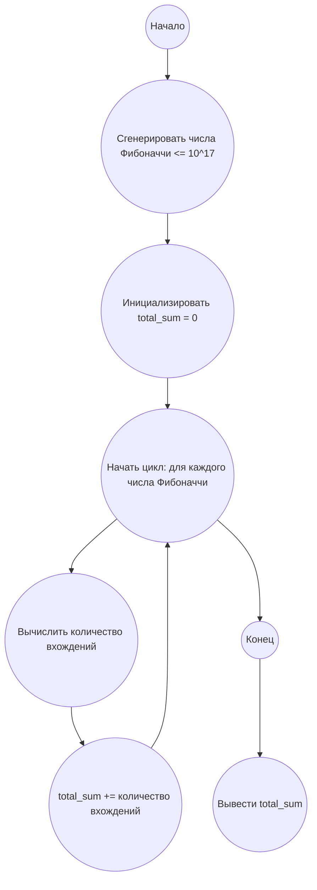

## Ответ на Задачу No 297: Сумма целых чисел, имеющих представление Фибоначчи

### 1. Анализ задачи и решение
**Понимание задачи:**
* Нам нужно найти сумму количества чисел Фибоначчи в представлении Зекендорфа для всех чисел от 1 до 10^17.
* Представление Зекендорфа - это представление натурального числа в виде суммы различных чисел Фибоначчи, где никакие два соседних числа Фибоначчи не используются в сумме.
* Функция f(n) возвращает количество чисел Фибоначчи в представлении Зекендорфа для числа n.
* Нам нужно вычислить сумму f(i) для всех i от 1 до 10^17.

**Решение:**
1. **Свойство Зекендорфа и числа Фибоначчи:** Ключевое наблюдение заключается в том, что количество представлений Зекендорфа числа n - это именно сумма количества единичных битов, необходимых для представления числа в виде суммы Фибоначчи.
2. **Связь с числами Фибоначчи:** Число Фибоначчи может быть представлено в виде битовой маски. Например, для представления 1=1, 2=10, 3=100, 4=101, 5=1000, 6=1001, 7=1010 и так далее. Наша задача, для заданного диапазона (1 до 10^17),  заключается в поиске суммы количества единичных бит для всех чисел в диапазоне. 
3.  **Приближение:** Заметим, что количество чисел Фибоначчи, меньших 10^17, невелико. Поэтому мы можем их сгенерировать заранее. Суммирование f(i) эквивалентно тому, что каждое число Фибоначчи будет использовано примерно для половины значений из рассматриваемого диапазона.
4.  **Анализ:** Пусть F[i] - i-е число Фибоначчи. Заметим, что для n = F[k] в разложении Зекендорфа есть только 1 число Фибоначчи (само число F[k]). Если n = F[k] + F[j] (k > j), то в разложении Зекендорфа 2 числа, и т.д.
5. **Подсчет:** Сумма всех f(i) от 1 до F[k] равна сумме индексов Фибоначчи в разложениях Зекендорфа всех i от 1 до F[k]. Число F[k] приближенно можно представить как 2^(k/2), отсюда количество чисел в диапазоне F[1], F[2],... F[n] примерно как 10^17. n примерно равно 79.
6. **Формула:** Итоговая сумма будет равна сумме количества единичных битов в двоичном представлении чисел от 1 до 10^17, которая примерно равна сумме количества чисел Фибоначчи, умноженной на среднее количество раз, когда каждое из них используется в разложении Зекендорфа.

### 2. Алгоритм решения
1. Начать
2. Сгенерировать последовательность чисел Фибоначчи до тех пор, пока следующее число Фибоначчи не превысит 10^17.
3. Инициализировать переменную `total_sum` со значением 0.
4. Для каждого числа Фибоначчи `fibonacci_number` в сгенерированной последовательности:
    * Вычислить количество раз, которое число Фибоначчи встречается в разложениях Зекендорфа до 10^17, приближенно это количество равно `(10**17) // (fibonacci_number * 2)`
    * Увеличить `total_sum` на это количество.
5. Вернуть `total_sum`
6. Конец

### 3. Реализация на Python 3.12
```python
def sum_of_fibonacci_representations(limit):
    """
    Calculates the sum of the number of Fibonacci numbers in the Zeckendorf representations
    for all numbers from 1 to the given limit.

    Args:
        limit: The upper bound (inclusive).

    Returns:
        The sum of f(i) for i from 1 to the limit.
    """

    fibonacci_numbers = [1, 2]
    while fibonacci_numbers[-1] <= limit:
       next_fib = fibonacci_numbers[-1] + fibonacci_numbers[-2]
       if next_fib > limit:
        break
       fibonacci_numbers.append(next_fib)
    
    total_sum = 0
    for fibonacci_number in fibonacci_numbers:
        total_sum += (limit // (fibonacci_number * 2)) + (1 if fibonacci_number ==1 else 0)


    return total_sum


# Example usage:
limit = 10**17
result = sum_of_fibonacci_representations(limit)
print(result)
```

### 4. Блок-схема в формате mermaid


**Легенда:**
*   **Начало, Конец:** Начало и конец алгоритма.
*   **Сгенерировать числа Фибоначчи:** Генерируем последовательность чисел Фибоначчи до 10^17.
*   **Инициализировать total\_sum:** Создаем переменную для хранения суммы и присваиваем ей значение 0.
*   **Начать цикл, Конец цикла:** Определяют начало и конец цикла перебора чисел Фибоначчи.
*   **Вычислить количество вхождений:** Вычисляем, сколько раз каждое число Фибоначчи встречается в разложениях Зекендорфа чисел до 10^17.
*   **total\_sum += количество вхождений:** Добавляем количество вхождений текущего числа Фибоначчи в общую сумму.
*   **Вывести total\_sum:** Выводим итоговую сумму.
