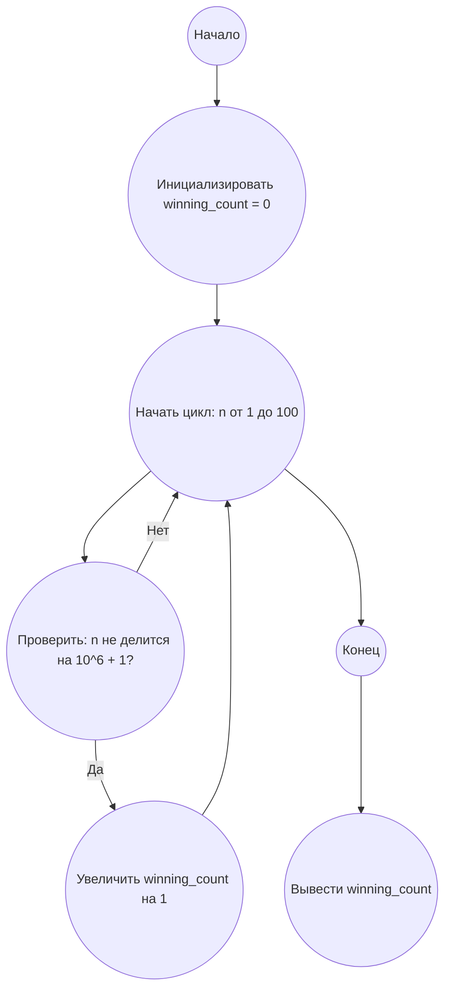

## Ответ на Задачу No 306: Игра с монетами

### 1. Анализ задачи и решение
**Понимание задачи:**

*   Два игрока по очереди берут от 1 до *m* монет из кучи.
*   Побеждает тот, кто заберет последнюю монету.
*   `M(n, m)` - истина, если первый игрок выигрывает при оптимальной игре.
*   `S(m)` - количество значений *n* (от 1 до 100), для которых `M(n, m)` истинно.
*   Нужно найти `S(10^6)`.

**Логика выигрыша/проигрыша:**
    * Если n = 0, то проигрывает игрок который должен ходить, так как нет монет
    * Если n = 1..m то выигрывает первый игрок, так как он может забрать все монеты.
    * Если n = m+1, то первый игрок сколько бы не взял монет от 1 до m он оставит второму от 1 до m монет, то есть второй игрок может забрать все и выиграть
    * Если n = k * (m + 1) то первый игрок проиграет, так как сколько бы он не взял от 1 до m, второй игрок всегда может оставить количество монет кратное m+1. 
    * В любом другом случае, первый игрок выиграет, потому что он может сделать так чтобы количество монет стало кратно m + 1.

**Решение:**

1.  Для каждого *m* мы можем определить, какие значения *n* (от 1 до 100) приводят к выигрышу первого игрока.
2.  Если *n* не кратно `m + 1`, то первый игрок выигрывает.
3.  `S(m)` - это количество *n*, не кратных `m + 1`, в диапазоне от 1 до 100.
4.  Нам нужно найти `S(10^6)`, поэтому необходимо подсчитать количество *n* от 1 до 100, которые не кратны `10^6 + 1`.

### 2. Алгоритм решения
1.  Начать
2.  Инициализировать `winning_count` как 0
3.  Для каждого `n` от 1 до 100:
    *   Если `n` не делится на `(10^6 + 1)`:
        *   Увеличить `winning_count` на 1
4.  Вернуть `winning_count`
5.  Конец

### 3. Реализация на Python 3.12
```python
def calculate_winning_count(m, limit):
  """
  Calculates the number of winning positions for the first player within a given limit.

  Args:
    m: The maximum number of coins a player can take.
    limit: The upper bound (inclusive) for the number of coins.

  Returns:
    The number of winning positions for the first player.
  """

  winning_count = 0
  for n in range(1, limit + 1):
      if n % (m + 1) != 0:
          winning_count += 1
  return winning_count


m_value = 10**6
limit_value = 100
result = calculate_winning_count(m_value, limit_value)
print(result)
```

### 4. Блок-схема в формате mermaid


**Legenda:**
*   **Начало, Конец:** Начало и конец алгоритма.
*   **Инициализировать winning_count = 0:** Присваиваем начальное значение 0 переменной, хранящей количество выигрышных ситуаций.
*  **Начать цикл, Конец цикла:** Определяют начало и конец цикла перебора чисел от 1 до 100.
*   **Проверить: n не делится на 10^6 + 1?** Проверяем, не делится ли текущее число на `10^6 + 1` без остатка.
*   **Увеличить winning_count на 1:** Если условие выполняется, увеличиваем количество выигрышных ситуаций на 1.
*   **Вывести winning_count:**  Выводим итоговое количество выигрышных ситуаций.
