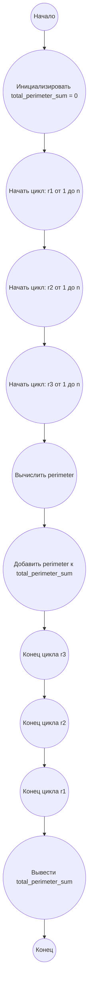

## Ответ на Задачу No 332: Круглые треугольники

### 1. Анализ задачи и решение
**Понимание задачи:**
*   Треугольник называется "круглым", если каждая его сторона касается окружности (т.е. окружности вписаны в треугольник).
*   Даны три круга C1, C2, и C3 с центрами (0,0), (x2, 0) и (x3, y3) и радиусами r1, r2, и r3, соответственно.
*   T(r1, r2, r3) - треугольник наименьшего периметра, для которого C1, C2 и C3 являются вписанными кругами.
*   Необходимо найти сумму периметров таких треугольников S(n) для всех возможных комбинаций радиусов r1, r2, и r3, где 1 ≤ r1, r2, r3 ≤ n.
*   Для вычисления периметра треугольника, вписанные круги которого имеют радиусы r1, r2, и r3, нужно воспользоваться формулой:
    
    perimeter = 4 \* (r1 \* r2 + r1 \* r3 + r2 \* r3) \* sqrt(r1 \* r2 + r1 \* r3 + r2 \* r3) / (r1 \* r2 \* r3)
*   Необходимо вычислить S(2500) с точностью до 8 знаков после запятой.

**Решение:**
1.  **Инициализация:** Создаем переменную `total_perimeter_sum` для хранения общей суммы периметров и устанавливаем ее в 0.
2.  **Тройной цикл:** Перебираем все возможные значения `r1`, `r2`, и `r3` от 1 до `n` включительно.
3.  **Вычисление периметра:** Для каждого набора `r1`, `r2`, и `r3`, вычисляем периметр треугольника с использованием приведенной выше формулы.
4.  **Суммирование:** Добавляем вычисленный периметр к `total_perimeter_sum`.
5.  **Возврат результата:** После завершения всех итераций возвращаем `total_perimeter_sum`.

### 2. Алгоритм решения
1. Начать
2. Инициализировать переменную `total_perimeter_sum` значением 0.
3. Для каждого `r1` от 1 до `n`
    * Для каждого `r2` от 1 до `n`
       * Для каждого `r3` от 1 до `n`
            * Вычислить `perimeter` = 4 * sqrt(r1 * r2 + r1 * r3 + r2 * r3) * (r1 * r2 + r1 * r3 + r2 * r3) / (r1 * r2 * r3)
            * Прибавить `perimeter` к `total_perimeter_sum`.
4. Вернуть `total_perimeter_sum`
5. Конец

### 3. Реализация на Python 3.12
```python
import math

def calculate_triangle_perimeter(r1, r2, r3):
    """
    Calculates the perimeter of a triangle given the radii of its incircles.

    Args:
      r1: Radius of the first incircle.
      r2: Radius of the second incircle.
      r3: Radius of the third incircle.

    Returns:
      The perimeter of the triangle.
    """
    sum_radii_prod = r1 * r2 + r1 * r3 + r2 * r3
    return 4 * math.sqrt(sum_radii_prod) * sum_radii_prod / (r1 * r2 * r3)

def sum_of_perimeters(n):
  """
  Calculates the sum of perimeters of triangles with incircle radii from 1 to n.

  Args:
    n: The upper bound for the radii.

  Returns:
    The sum of perimeters of the triangles.
  """
  total_perimeter_sum = 0
  for r1 in range(1, n + 1):
    for r2 in range(1, n + 1):
      for r3 in range(1, n + 1):
        perimeter = calculate_triangle_perimeter(r1, r2, r3)
        total_perimeter_sum += perimeter
  return total_perimeter_sum

# Пример использования:
n = 2500
result = sum_of_perimeters(n)
print(f"{result:.8f}")
```

### 4. Блок-схема в формате mermaid


**Легенда:**
* **Начало, Конец:** Начало и конец алгоритма.
* **Инициализировать total_perimeter_sum:** Создаем переменную для хранения общей суммы периметров и присваиваем ей начальное значение 0.
* **Начать цикл: r1 от 1 до n, Конец цикла r1:** Определяют начало и конец внешнего цикла перебора радиуса r1.
* **Начать цикл: r2 от 1 до n, Конец цикла r2:** Определяют начало и конец цикла перебора радиуса r2.
* **Начать цикл: r3 от 1 до n, Конец цикла r3:** Определяют начало и конец внутреннего цикла перебора радиуса r3.
* **Вычислить perimeter:** Вычисляем периметр треугольника на основе текущих r1, r2, r3 по заданной формуле.
* **Добавить perimeter к total_perimeter_sum:** Прибавляем вычисленный периметр к общей сумме.
*  **Вывести total_perimeter_sum:** Выводим итоговую сумму периметров.
