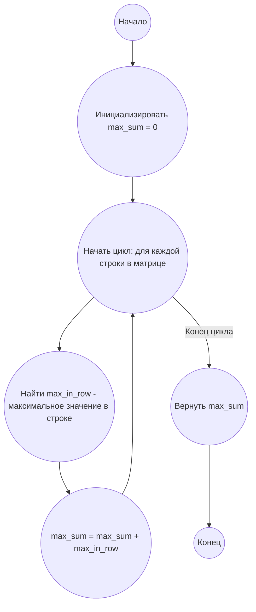

## Ответ на Задачу No 345: Сумма в матрице

### 1. Анализ задачи и решение
**Понимание задачи:**
*   Нам дан квадратный массив (матрица) размером n x n.
*   Необходимо выбрать по одному числу из каждой строки.
*   Цель - найти максимальную возможную сумму этих n выбранных чисел.
*   Из условия следует, что в каждой строке нужно выбрать максимальное число и сложить их.

**Решение:**
1.  **Инициализация:** Создаем переменную `max_sum` для хранения максимальной суммы и устанавливаем её в 0.
2.  **Перебор строк:** Итерируемся по каждой строке матрицы.
3.  **Поиск максимума в строке:** Для каждой строки находим максимальное значение.
4.  **Накопление суммы:** Прибавляем найденный максимум строки к `max_sum`.
5.  **Возврат результата:** После обработки всех строк возвращаем значение `max_sum`.

### 2. Алгоритм решения
1.  Начать.
2.  Инициализировать `max_sum` = 0.
3.  Для каждой строки в матрице:
    *   Найти `max_in_row` - максимальное значение в текущей строке.
    *   `max_sum` = `max_sum` + `max_in_row`.
4.  Вернуть `max_sum`.
5.  Конец.

### 3. Реализация на Python 3.12
```python
def max_sum_from_matrix(matrix):
    """
    Calculates the maximum sum by picking one element from each row of a matrix.

    Args:
        matrix: A list of lists representing a square matrix.

    Returns:
        The maximum sum achievable by picking one number from each row.
    """
    max_sum = 0
    for row in matrix:
        max_sum += max(row)
    return max_sum


def read_matrix_from_file(filename):
    """
    Reads a matrix from a text file.

    Args:
        filename: The path to the file containing the matrix.

    Returns:
        A list of lists representing the matrix.
    """
    matrix = []
    with open(filename, 'r') as file:
        for line in file:
            row = list(map(int, line.split()))
            matrix.append(row)
    return matrix


# Пример использования:
matrix_file = 'matrix.txt'
matrix = read_matrix_from_file(matrix_file)
result = max_sum_from_matrix(matrix)
print(result)
```
Для корректной работы примера необходимо наличие файла `matrix.txt` в той же директории, что и скрипт. Содержимое файла должно быть матрицей чисел, разделенных пробелами. Например:
```
1 2 3 4
2 3 4 5
3 4 5 6
4 5 6 7
```

### 4. Блок-схема в формате mermaid


**Legenda:**
*   **Начало, Конец:** Начало и конец алгоритма.
*   **Инициализировать max\_sum = 0:** Создаем переменную `max_sum` для хранения максимальной суммы и присваиваем ей начальное значение 0.
*   **Начать цикл: для каждой строки в матрице, Конец цикла:** Определяют начало и конец цикла перебора строк матрицы.
*   **Найти max\_in\_row - максимальное значение в строке:** Находим максимальное число в текущей строке.
*   **max\_sum = max\_sum + max\_in\_row:** Прибавляем максимальное число из текущей строки к общей сумме `max_sum`.
*   **Вернуть max\_sum:** Возвращаем вычисленное максимальное значение суммы.
