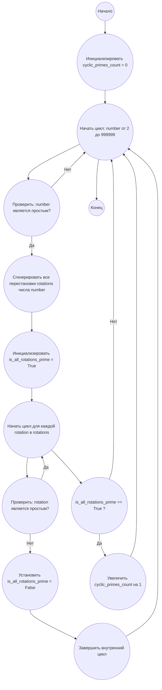

## Ответ на Задачу No 35: Циклические простые числа

### 1. Анализ задачи и решение
**Понимание задачи:**
* Нам нужно найти количество циклических простых чисел меньше миллиона.
* Циклическое простое число - это простое число, все циклические перестановки цифр которого также являются простыми числами.
* Нужно перебрать все числа от 2 до 999999, проверить каждое на простоту, затем создать все циклические перестановки и также проверить их на простоту. Если все перестановки простые, то число - циклически простое.

**Решение:**
1. **Функция проверки простоты:** Создаем функцию `is_prime(n)` для проверки, является ли число простым.
2. **Функция генерации перестановок:** Создаем функцию `generate_rotations(n)`, которая генерирует все циклические перестановки числа `n`.
3. **Основная логика:** Проходим в цикле по всем числам от 2 до 999999. Для каждого числа:
   * Проверяем, является ли число простым, используя `is_prime`.
   * Если число простое, генерируем все его циклические перестановки, используя `generate_rotations`.
   * Проверяем, все ли перестановки простые, используя `is_prime`. Если все простые, увеличиваем счетчик циклических простых чисел.
4. **Возврат результата:** После окончания цикла возвращаем значение счетчика.

### 2. Алгоритм решения
1. Начать
2. Инициализировать переменную `cyclic_primes_count` со значением 0
3. Для каждого числа `number` от 2 до 999999:
   * Если `number` является простым числом:
        * Сгенерировать все циклические перестановки `rotations` числа `number`
        * Инициализировать переменную `is_all_rotations_prime` значением True
        * Для каждой перестановки `rotation` в `rotations`:
            * Если `rotation` не является простым числом:
                * Установить `is_all_rotations_prime` в False
                * Завершить внутренний цикл
        * Если `is_all_rotations_prime` равно True:
             * Увеличить `cyclic_primes_count` на 1
4. Вернуть `cyclic_primes_count`
5. Конец

### 3. Реализация на Python 3.12
```python
import math

def is_prime(n):
    """
    Checks if a number is prime.

    Args:
      n: The number to check.

    Returns:
      True if n is prime, False otherwise.
    """
    if n < 2:
        return False
    for i in range(2, int(math.sqrt(n)) + 1):
        if n % i == 0:
            return False
    return True

def generate_rotations(n):
    """
    Generates all cyclic permutations of a number.

    Args:
      n: The number to generate permutations from.

    Returns:
       A list of cyclic permutations.
    """
    s = str(n)
    rotations = []
    for i in range(len(s)):
        rotations.append(int(s[i:] + s[:i]))
    return rotations

def count_cyclic_primes(limit):
    """
    Counts the number of cyclic primes below the given limit.

    Args:
      limit: The upper bound (exclusive).

    Returns:
      The number of cyclic primes.
    """
    cyclic_primes_count = 0
    for number in range(2, limit):
        if is_prime(number):
            rotations = generate_rotations(number)
            is_all_rotations_prime = True
            for rotation in rotations:
                if not is_prime(rotation):
                    is_all_rotations_prime = False
                    break
            if is_all_rotations_prime:
                cyclic_primes_count += 1
    return cyclic_primes_count

# Пример использования:
limit = 1000000
result = count_cyclic_primes(limit)
print(result)
```

### 4. Блок-схема в формате mermaid


**Легенда:**
*   **Начало, Конец:** Начало и конец алгоритма.
*   **Инициализировать cyclic_primes_count = 0:** Создаем переменную для хранения количества циклических простых чисел и присваиваем ей значение 0.
*   **Начать цикл: number от 2 до 999999:** Начало цикла, перебирающего все числа от 2 до 999999.
*   **Проверить: number является простым?:** Проверяем, является ли текущее число простым.
*  **Сгенерировать все перестановки rotations числа number:** Генерируем все циклические перестановки цифр текущего числа.
*   **Инициализировать is_all_rotations_prime = True:** Инициализируем флаг, который будет отслеживать, являются ли все перестановки простыми.
*   **Начать цикл для каждой rotation в rotations:** Начало цикла, перебирающего все циклические перестановки текущего числа.
*   **Проверить: rotation является простым?:** Проверяем, является ли текущая перестановка простым числом.
*   **Установить is_all_rotations_prime = False:** Если перестановка не является простой, устанавливаем флаг в `False`.
*   **Завершить внутренний цикл:** Выход из цикла перебора перестановок, если найдена непростая перестановка.
*   **is_all_rotations_prime == True?:** Проверяем, является ли значение флага `True`
*   **Увеличить cyclic_primes_count на 1:** Если все перестановки были простыми, увеличиваем счетчик циклических простых чисел.
*   **Конец цикла:** Конец перебора чисел.
