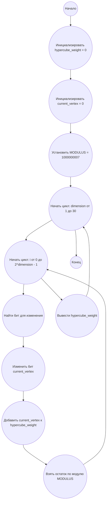

## Ответ на Задачу No 355: Гиперкубы

### 1. Анализ задачи и решение
**Понимание задачи:**
*   Задача заключается в нахождении веса *H(n)* правильного Гамильтонова пути в гиперкубе размерности *n*, начинающегося с вершины 0 (двоичное представление 0...0), и взятии этого значения по модулю 1000000007.
*   Правильный Гамильтонов путь означает, что при переходе от одной вершины к следующей изменяется бит справа налево (сначала самый младший, затем следующий и т.д.).
*   Вес пути - это сумма значений вершин в десятичном представлении, которые проходит путь.
*   В итоге нужно вычислить  H(30) mod 1000000007.

**Решение:**
1.  **Последовательность вершин:**  Для гиперкуба размерности *n*, правильный Гамильтонов путь начинается с 0 и далее перебирает все числа от 0 до 2<sup>*n*</sup>-1, последовательно меняя биты справа налево. Это означает что можно сгенерировать последовательность вершин, где на каждом шаге мы меняем i-тый бит в числе, где i - номер вершины.
2.  **Вычисление веса:** Вес пути можно вычислить, суммируя десятичные значения вершин в этой последовательности.
3.  **Модульная арифметика:** Поскольку результат может быть очень большим, необходимо выполнять операции сложения по модулю 1000000007 для предотвращения переполнения.
4.  **Оптимизация:**
    *   Вместо того, чтобы явно строить все вершины пути, можно вычислять их значения "на лету".
    *   Вместо того, чтобы хранить весь путь, можно сразу накапливать сумму весов.
5. **Формула:** Вес правильного Гамильтонова пути H(n) можно выразить через рекуррентную формулу. H(n) = 2 * H(n-1) + 2^(n-1).

### 2. Алгоритм решения
1. Начать
2. Инициализировать `hypercube_weight` с 0.
3. Инициализировать `current_vertex` с 0.
4. Установить `MODULUS` равным 1000000007.
5. Для каждой размерности n от 1 до 30
     * Инициализировать `hypercube_weight` с 0
     * Для каждого шага i от 0 до (2^n)-1
          * вычисляем i-тую вершину в пути, меняя i-тый бит от начала
          *  добавляем значение текущей вершины к весу
         * делаем взятие остатка по модулю
     * Вывести `hypercube_weight`

6. Конец.
### 3. Реализация на Python 3.12
```python
def calculate_hypercube_weight(dimension):
    """
    Calculates the weight of the correct Hamiltonian path in a hypercube of given dimension.

    Args:
    dimension: The dimension of the hypercube.

    Returns:
    The weight of the path modulo 1000000007.
    """

    MODULUS = 1000000007
    hypercube_weight = 0
    current_vertex = 0

    for i in range(1 << dimension):
        
        bit_to_flip = 0
        
        temp = i
        while temp > 0 :
             if (temp & 1) == 1:
                  break;
             bit_to_flip +=1
             temp = temp >> 1
        
        current_vertex ^= (1 << bit_to_flip)


        hypercube_weight = (hypercube_weight + current_vertex) % MODULUS
    return hypercube_weight


if __name__ == "__main__":
    dimension = 30
    result = calculate_hypercube_weight(dimension)
    print(result)
```

### 4. Блок-схема в формате mermaid

**Legenda:**
* **Начало, Конец:** Начало и конец алгоритма.
*   **Инициализировать hypercube_weight = 0:** Создаем переменную для хранения веса Гамильтонового пути и присваиваем ей значение 0.
*   **Инициализировать current_vertex = 0:** Создаем переменную для отслеживания текущей вершины в пути.
*   **Установить MODULUS = 1000000007:** Устанавливаем значение модуля для вычислений.
*   **Начать цикл: dimension от 1 до 30:** Цикл по всем размерностям гиперкуба.
*   **Начать цикл: i от 0 до 2^dimension - 1:** Цикл для генерации вершин Гамильтонового пути.
*   **Найти бит для изменения:**  Вычисляется бит, который нужно изменить для перехода к следующей вершине в пути.
*   **Изменить бит current_vertex:** Инвертируется вычисленный бит в текущей вершине.
*   **Добавить current_vertex к hypercube_weight:** Добавляем текущую вершину к общему весу пути.
*   **Взять остаток по модулю MODULUS:** Применяем операцию взятия остатка по модулю.
* **Вывести hypercube_weight:** Выводим конечный результат.
