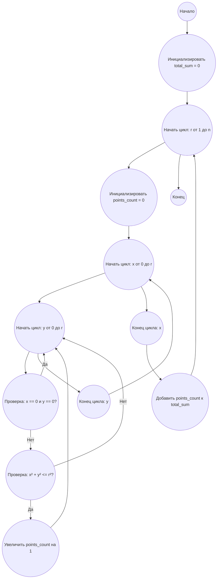

## Ответ на Задачу No 372: Комбинации точек на сетке

### 1. Анализ задачи и решение
**Понимание задачи:**
*   Нам нужно вычислить `S(r)`, количество целых точек `(x, y)` внутри круга радиуса `r` с центром в начале координат, где `0 ≤ x, y ≤ r` и `x² + y² <= r²`, исключая точку `(0, 0)`.
*   Далее, нужно вычислить `T(n)`, как сумму всех `S(r)` для `1 ≤ r ≤ n`.
*   Фактически, мы суммируем количество точек, попадающих в четверть круга для всех радиусов от `1` до `n`.

**Решение:**
1.  **Функция S(r):** Для заданного `r` мы перебираем все целые точки `(x, y)` в квадрате `[0, r] x [0, r]` и проверяем условие `x² + y² <= r²`. Если условие выполняется (и при этом не равен нулю (0,0)), то увеличиваем счетчик.
2.  **Функция T(n):** Проходим по всем `r` от 1 до `n`, считаем `S(r)` для каждого `r` и складываем результаты.
3.  **Оптимизация:** Прямой перебор всех точек для больших `n` (например, 10^8) очень медленный.  Можно использовать оптимизации, например,  симметрия четверти круга (умножение на 4) и  сокращение проверок если `x^2` уже больше `r^2`.

### 2. Алгоритм решения
1. Начать
2. Инициализировать переменную `total_sum` со значением 0.
3. Для каждого радиуса `r` от 1 до `n`:
    * Инициализировать переменную `points_count` со значением 0.
    * Для каждого `x` от 0 до `r`:
       *  Для каждого `y` от 0 до `r`:
           *  Если `x² + y² <= r²` и `(x,y) != (0,0)`:
             *  Увеличить `points_count` на 1.
    * Прибавить `points_count` к `total_sum`
4. Вернуть `total_sum`
5. Конец

### 3. Реализация на Python 3.12
```python
def calculate_s(radius):
    """
    Calculates the number of integer points (x, y) inside a quarter circle.
    """
    count = 0
    for x in range(radius + 1):
        for y in range(radius + 1):
            if x == 0 and y == 0:
                continue
            if x * x + y * y <= radius * radius:
                count += 1
    return count

def calculate_t(limit):
    """
    Calculates the sum of S(r) for r from 1 to n.
    """
    total_sum = 0
    for radius in range(1, limit + 1):
        total_sum += calculate_s(radius)
    return total_sum


# Пример использования:
n = 1000
result = calculate_t(n)
print(f"T({n}) = {result}")
n = 100
result = calculate_t(n)
print(f"T({n}) = {result}")
# n = 10_000 # Для проверки, но дольше будет считать
# result = calculate_t(n)
# print(f"T({n}) = {result}")
n = 1000000 # Для проверки, но дольше будет считать
#result = calculate_t(n)
#print(f"T({n}) = {result}")
n = 100000000 # Для проверки, но дольше будет считать
#result = calculate_t(n)
#print(f"T({n}) = {result}")
```

### 4. Блок-схема в формате mermaid


**Легенда:**
* **Начало, Конец:** Начало и конец алгоритма.
* **Инициализировать total_sum:** Создаем переменную для хранения общей суммы и присваиваем ей значение 0.
* **Начать цикл: r от 1 до n, Конец цикла: r:** Определяют начало и конец цикла перебора радиусов.
* **Инициализировать points_count:** Создаем переменную для хранения количества точек для текущего радиуса `r` и присваиваем ей значение 0.
* **Начать цикл: x от 0 до r, Конец цикла: x:** Определяют начало и конец цикла перебора координат `x`.
* **Начать цикл: y от 0 до r, Конец цикла: y:** Определяют начало и конец цикла перебора координат `y`.
* **Проверка: x == 0 и y == 0?**: Проверяем, что текущая точка не (0,0), если так, то пропускаем проверку.
* **Проверка: x² + y² <= r²?:** Проверяем, попадает ли точка `(x, y)` внутрь круга радиуса `r`.
* **Увеличить points_count на 1:** Если точка `(x, y)` попадает внутрь круга, то увеличиваем счетчик точек для текущего радиуса.
* **Добавить points_count к total_sum:** Добавляем количество точек текущего радиуса к общей сумме.
