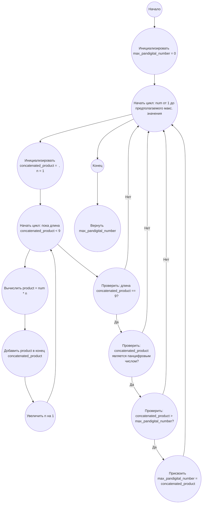

## Ответ на Задачу No 38: Панцифровые произведения

### 1. Анализ задачи и решение
**Понимание задачи:**
* Задача состоит в поиске наибольшего панцифрового числа (содержащего все цифры от 1 до 9 ровно один раз), которое может быть получено путем конкатенации произведений некоторого целого числа на последовательность (1, 2, ..., n), где n > 1.

**Рассуждения:**
1. **Ограничения:** Нам нужно найти максимальное панцифровое число, значит, нам нужно перебирать числа, которые при умножении дают 9-значное число.  
2. **Длина конкатенации:** Максимальная длина конкатенации (n) ограничена. Если n = 2, то мы получим число из двух произведений. Если n = 3, то из трех произведений и тд.  Мы знаем, что нам нужно получить 9-значное число. Так как минимальное произведение 1 * num > 0, а каждое последущее произведение увеличивается, нам нужно не более 9/2 произведений. То есть 5 произведений.
3. **Проверка панцифрового числа:** После конкатенации чисел необходимо проверить, является ли результат панцифровым числом от 1 до 9.

**Решение:**
1. **Перебор чисел:** Перебираем целые числа от 1 до некоторого предела (можно начать с 1 и увеличивать пока длина результата конкатенации не превысит 9).
2. **Генерация конкатенированного произведения:** Для каждого числа генерируем конкатенированное произведение, умножая его на последовательность (1, 2, ..., n). n будем увеличивать, пока длина конкатенированной строки не станет больше 9 символов. 
3. **Проверка на панцифровое число:** Проверяем, является ли полученное конкатенированное произведение панцифровым (содержит все цифры от 1 до 9 ровно один раз).
4. **Отслеживание максимального:** Если нашли панцифровое число, проверяем, больше ли оно текущего максимального.

### 2. Алгоритм решения
1. Начать
2. Инициализировать `max_pandigital_number` значением 0
3. Для каждого числа `num` от 1 до предполагаемого максимального значения
    1. Инициализировать `concatenated_product` = ""
    2. Для `n` от 1 
        1.  Вычислить `product = num * n`
        2.  Добавить `product` в конец `concatenated_product`
        3.  Если длина `concatenated_product` > 9 прервать цикл по `n`
    3.  Если длина `concatenated_product` == 9:
        1. Если `concatenated_product` является панцифровым числом от 1 до 9:
            1. Если `concatenated_product` > `max_pandigital_number`:
                 1. Присвоить `max_pandigital_number` = `concatenated_product`
4.  Вернуть `max_pandigital_number`
5.  Конец

### 3. Реализация на Python 3.12
```python
def is_pandigital(number_str):
    """
    Checks if a given string is a pandigital number (contains digits 1 to 9 exactly once).

    Args:
        number_str: The string to check.

    Returns:
        True if the string is pandigital, False otherwise.
    """
    return set(number_str) == set('123456789') and len(number_str) == 9


def find_largest_pandigital_product():
    """
    Finds the largest pandigital number that can be formed as a concatenated product.

    Returns:
        The largest pandigital number or None if none is found.
    """
    max_pandigital_number = 0
    for num in range(1, 10000):
        concatenated_product = ""
        n = 1
        while len(concatenated_product) < 9:
             product = num * n
             concatenated_product += str(product)
             n += 1
        if len(concatenated_product) == 9:
           if is_pandigital(concatenated_product):
               if int(concatenated_product) > max_pandigital_number:
                   max_pandigital_number = int(concatenated_product)

    return max_pandigital_number if max_pandigital_number > 0 else None

# Run and print the result
largest_pandigital = find_largest_pandigital_product()
print(largest_pandigital)

```

### 4. Блок-схема в формате mermaid


**Легенда:**
* **Start, End:** Начало и конец алгоритма.
* **InitializeMaxPandigital:** Инициализация переменной `max_pandigital_number` для хранения наибольшего панцифрового произведения (изначально 0).
* **LoopNumStart:** Начало внешнего цикла перебора чисел `num`.
* **InitializeConcatenatedProduct:** Инициализация переменной `concatenated_product` (пустая строка) и `n` = 1 для формирования конкатенированного произведения для каждого `num`.
*  **LoopNStart:**  Начало цикла, пока длина `concatenated_product` < 9.
* **CalculateProduct:** Вычисление произведения `product` = `num` * `n`
* **AddProductToConcatenated:** Добавление `product` в конец `concatenated_product`
* **IncrementN:** Увеличение `n` на 1.
* **CheckLengthConcatenated:** Проверка:  длина `concatenated_product` == 9?
* **CheckPandigital:** Проверка: является ли `concatenated_product` панцифровым числом от 1 до 9?
* **CompareWithMax:** Сравнение `concatenated_product` с текущим максимальным `max_pandigital_number`.
* **UpdateMaxPandigital:** Обновление `max_pandigital_number`, если `concatenated_product` больше текущего значения.
* **ReturnMaxPandigital:** Возвращение наибольшего панцифрового числа.
