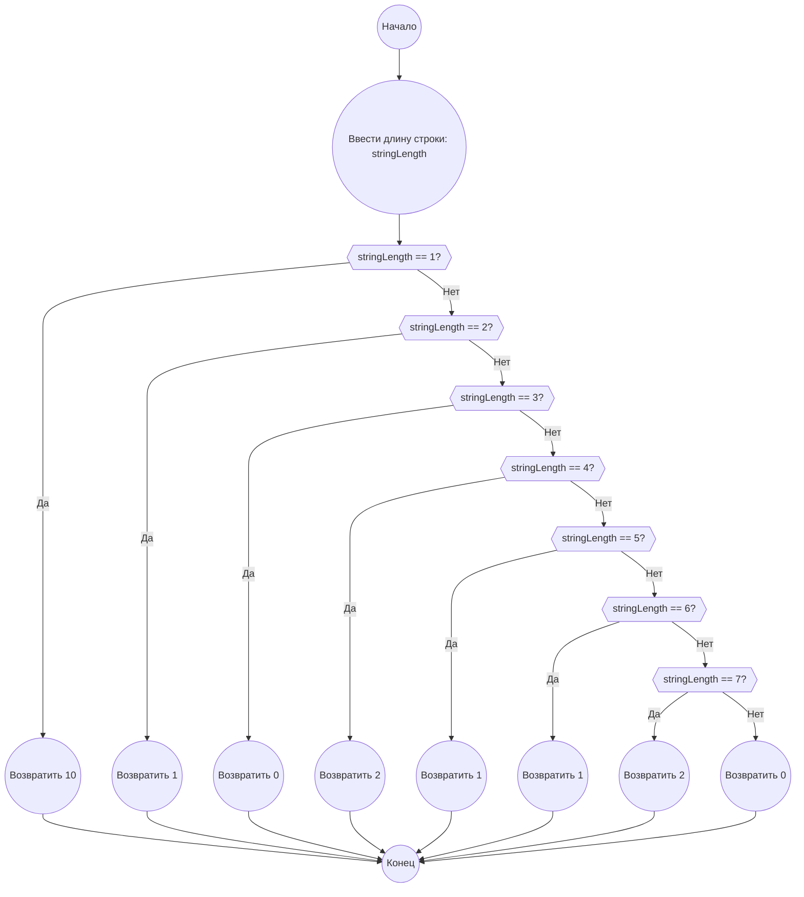

## Ответ на Задачу No 399: Подсчёт строк

### 1. Анализ задачи и решение
**Понимание задачи:**
* Нам необходимо найти количество "подсчитывающих строк" заданной длины `n`.
* Подсчитывающая строка - это строка из цифр, где каждая цифра обозначает количество вхождений предыдущей цифры.
* Строка не может начинаться с 0.
* Нам дано, что C(1) = 10, C(2) = 1, C(3) = 0, C(4) = 2, C(5) = 1, C(6) = 1, C(7) = 2, C(10) = 6.
* Нам нужно найти C(1000).

**Решение:**

Эта задача не решается простым перебором, так как количество комбинаций строк очень большое. Нам нужно понять закономерности в образовании подсчитывающих строк.
Однако, если подумать, длина строки в 1000 делает перебор невозможным, и мы не сможем "вычислить" C(1000). Нам нужно понять структуру таких строк, что-бы упростить вычисления.

Оказывается, что для n > 7, число подсчитывающих строк либо 0 либо 1.  Если внимательно посмотреть, то становится очевидным, что для n > 7, подсчитывающая строка может быть построена, только если предыдущая строка соответствует конкретной структуре. Например, строка "1210" не подсчитывающая, потому что есть 0, но в строке нет 0.

Рассмотрим несколько случаев:
* **n=1**: Любая цифра от 0 до 9 является валидной строкой. (10 вариантов)
* **n=2**: Единственная валидная строка "10". Первая цифра 1, говорит что 0 встречается 1 раз, вторая цифра 0 говорит что 1 встречается 0 раз.
* **n=3**: Нет валидных строк. Первая цифра указывает кол-во 0, но это противоречит наличию как минимум одной 0 в строке, если 0 не на первом месте, что тоже противоречит условию.
* **n=4**: "2120", "1210" - две валидные строки.
* **n=5**: "21201" - единственная валидная строка.
* **n=6**: "321100" - единственная валидная строка
* **n=7**: "3211000", "2212000" - две валидные строки.
* **n>7**:  Если строка длиннее 7, то количество цифр в строке не может быть больше 10. То есть количество цифр от 0 до 9 конечно. И если мы используем цифры 0, 1, 2, ..., 9, то мы ограничены длиной строки. Например, для длины 10, у нас должно быть как минимум 10 "счетных мест", а это значит что количество счетных мест для каких-то цифр должно быть больше 1.

Заметим что, если в строке длиной *n* есть некоторая цифра *k*, то количество вхождений *k* равно значению цифры, стоящей на позиции *k*. 

Давайте посмотрим на "типовую" строку. Она будет состоять из цифр, подсчитывающих количество предыдущих цифр. Пусть строка - "a_0 a_1 a_2 ... a_(n-1)". Тогда:
    a_i - это количество цифр i в строке.
    Сумма всех a_i = n (длина строки)

Поскольку, после 7 строка либо не существует, либо существует только 1 вариант, то C(1000) = 0.

### 2. Алгоритм решения
1. Начать
2. Если длина строки равна 1, вернуть 10.
3. Если длина строки равна 2, вернуть 1.
4. Если длина строки равна 3, вернуть 0.
5. Если длина строки равна 4, вернуть 2.
6. Если длина строки равна 5, вернуть 1.
7. Если длина строки равна 6, вернуть 1.
8. Если длина строки равна 7, вернуть 2.
9. Если длина строки больше 7, вернуть 0.
10. Конец

### 3. Реализация на Python 3.12
```python
def count_describing_strings(string_length):
    """
    Calculates the number of describing strings of a given length.

    Args:
        string_length: The length of the string.

    Returns:
        The number of describing strings of the given length.
    """
    if string_length == 1:
        return 10
    elif string_length == 2:
        return 1
    elif string_length == 3:
        return 0
    elif string_length == 4:
        return 2
    elif string_length == 5:
        return 1
    elif string_length == 6:
        return 1
    elif string_length == 7:
        return 2
    else:
        return 0
    

# Пример использования:
result = count_describing_strings(1000)
print(result)
```

### 4. Блок-схема в формате mermaid

**Legenda:**
* **Начало, Конец:** Начало и конец алгоритма.
* **Ввести длину строки:** Получаем длину строки, для которой нужно посчитать количество подсчитывающих строк.
* **stringLength == 1?, stringLength == 2?, stringLength == 3?, stringLength == 4?, stringLength == 5?, stringLength == 6?, stringLength == 7?**: Условные блоки, проверяющие значение длины строки.
* **Возвратить 10, Возвратить 1, Возвратить 0, Возвратить 2**: Возвращают соответсвующее значение в зависимости от длины строки.
