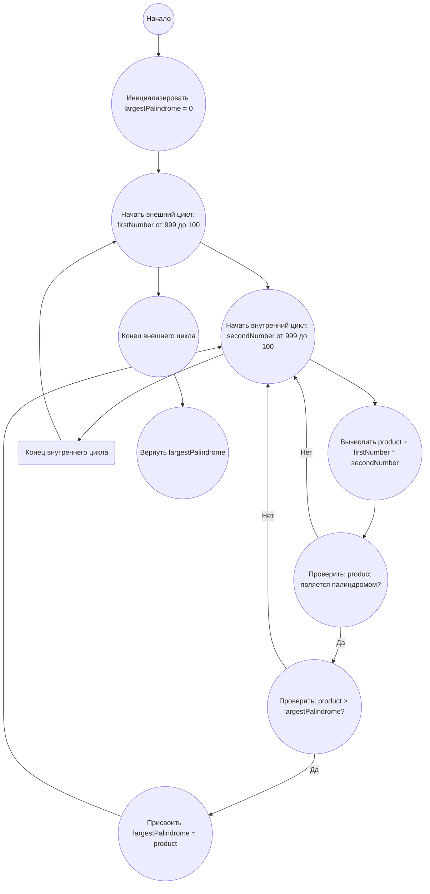

## Ответ на Задачу No 4: Наибольший палиндром из произведения двух трехзначных чисел

### 1. Анализ задачи и решение
**Понимание задачи:**
* Необходимо найти наибольший палиндром, который является произведением двух трехзначных чисел.
* Палиндром - это число, которое читается одинаково как слева направо, так и справа налево.
* Требуется перебрать все возможные произведения двух трехзначных чисел и проверить, является ли результат палиндромом.
* Из всех палиндромов нужно выбрать наибольший.

**Решение:**
1.  **Генерация пар чисел:** Перебираем все пары трехзначных чисел, начиная с наибольших (999) до наименьших (100).
2.  **Вычисление произведения:** Для каждой пары вычисляем их произведение.
3.  **Проверка на палиндром:** Проверяем, является ли полученное произведение палиндромом.
4.  **Сравнение и обновление максимума:** Если текущее произведение является палиндромом и оно больше текущего максимального палиндрома, то обновляем значение максимального палиндрома.
5.  **Возврат результата:** После перебора всех пар возвращаем максимальный найденный палиндром.

### 2. Алгоритм решения
1. Начать.
2. Инициализировать переменную `largestPalindrome` значением 0.
3. Для каждого числа `firstNumber` от 999 до 100
    * Для каждого числа `secondNumber` от 999 до 100
        * Вычислить `product` = `firstNumber` * `secondNumber`
        * Проверить, является ли `product` палиндромом
            * Если `product` является палиндромом и `product` > `largestPalindrome`
                * Присвоить `largestPalindrome` значение `product`
4. Вернуть `largestPalindrome`.
5. Конец

### 3. Реализация на Python 3.12
```python
def is_palindrome(number):
    """Checks if a number is a palindrome."""
    return str(number) == str(number)[::-1]

def find_largest_palindrome_product():
    """Finds the largest palindrome made from the product of two 3-digit numbers."""
    largest_palindrome = 0
    for firstNumber in range(999, 99, -1):
        for secondNumber in range(999, 99, -1):
            product = firstNumber * secondNumber
            if is_palindrome(product) and product > largest_palindrome:
                largest_palindrome = product
    return largest_palindrome

# Пример использования:
result = find_largest_palindrome_product()
print(result)
```

### 4. Блок-схема в формате mermaid


**Легенда:**
* **Начало, Конец:** Начало и конец алгоритма.
* **Инициализировать largestPalindrome:** Создаем переменную для хранения максимального палиндрома и присваиваем ей начальное значение 0.
* **Начать внешний цикл, Конец внешнего цикла:** Определяют начало и конец внешнего цикла перебора чисел от 999 до 100.
* **Начать внутренний цикл, Конец внутреннего цикла:** Определяют начало и конец внутреннего цикла перебора чисел от 999 до 100.
* **Вычислить product:** Вычисляем произведение `firstNumber` и `secondNumber`.
* **Проверить: product является палиндромом?** Проверяем, является ли полученное произведение палиндромом.
* **Проверить: product > largestPalindrome?** Проверяем, больше ли текущий палиндром максимального найденного.
* **Присвоить largestPalindrome = product:** Обновляем значение `largestPalindrome`, если текущий палиндром больше.
* **Вернуть largestPalindrome:** Возвращаем наибольший найденный палиндром.
