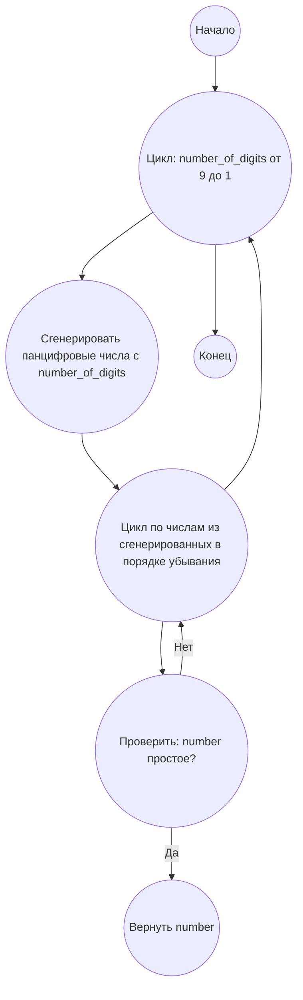

## Ответ на Задачу No 41: Панцифровое простое число

### 1. Анализ задачи и решение
**Понимание задачи:**
* Нам нужно найти наибольшее n-значное число, которое является панцифровым (содержит все цифры от 1 до n ровно один раз) и является простым числом.
* Поскольку нам нужно найти наибольшее такое число, логично начать проверку с наибольших возможных n (9-значное) и постепенно уменьшать n до тех пор, пока не найдем подходящее число. 
* Для проверки простоты числа будем использовать оптимизированную проверку деления до корня числа.

**Решение:**
1. **Генерация панцифровых чисел:** Для каждого значения n (от 9 до 1) генерируем все возможные n-значные панцифровые числа, начиная с наибольшего (отсортированные в обратном порядке).
2. **Проверка простоты:** Для каждого сгенерированного панцифрового числа проверяем, является ли оно простым.
3. **Возврат результата:** Как только найдено первое простое панцифровое число, возвращаем его.
4. **Оптимизация**: Начинаем перебор с 9-значных чисел, и уменьшаем количество цифр.

### 2. Алгоритм решения
1. Начать
2. Для `number_of_digits` от 9 до 1:
   *  Генерировать все панцифровые числа с `number_of_digits` в порядке убывания
   * Для каждого `number` из сгенерированных панцифровых чисел:
       *  Если `number` простое:
           *  Вернуть `number`
3. Конец

### 3. Реализация на Python 3.12
```python
import itertools
import math

def is_prime(number):
    """
    Checks if a number is prime.
    """
    if number < 2:
        return False
    for i in range(2, int(math.sqrt(number)) + 1):
        if number % i == 0:
            return False
    return True

def generate_pandigital(num_digits):
    """
    Generates pandigital numbers with num_digits digits.
    """
    digits = [str(i) for i in range(1, num_digits + 1)]
    for permutation in itertools.permutations(digits):
         yield int("".join(permutation))
   
def find_largest_pandigital_prime():
    """
    Finds the largest pandigital prime number.
    """
    for num_digits in range(9, 0, -1):
       for number in sorted(generate_pandigital(num_digits), reverse = True):
            if is_prime(number):
                return number
    return None

# Example usage:
result = find_largest_pandigital_prime()
print(result)
```

### 4. Блок-схема в формате mermaid


**Легенда:**
* **Начало, Конец:** Начало и конец алгоритма.
* **Цикл: number_of_digits от 9 до 1:** Цикл, который перебирает количество цифр в панцифровом числе от 9 до 1.
* **Сгенерировать панцифровые числа с number_of_digits:** Генерирует все возможные n-значные панцифровые числа.
*  **Цикл по числам из сгенерированных в порядке убывания:** Цикл, который перебирает сгенерированные числа в порядке убывания.
* **Проверить: number простое?** Проверяет, является ли текущее число простым.
* **Вернуть number:** Возвращает найденное простое панцифровое число.
