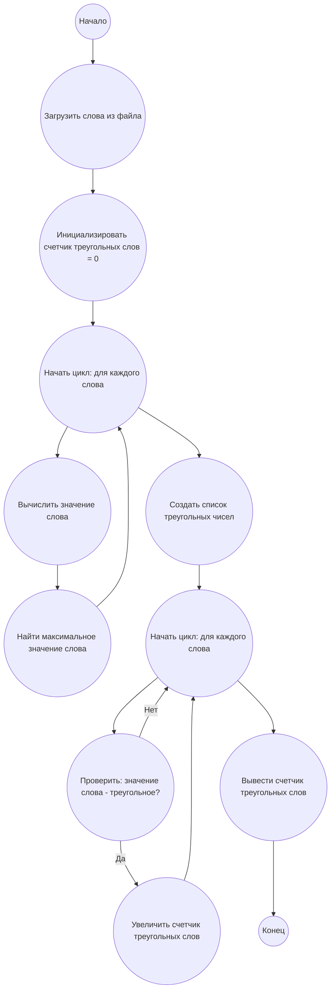

## Ответ на Задачу No 42: Кодированные треугольные числа

### 1. Анализ задачи и решение
**Понимание задачи:**
* Необходимо определить треугольные числа. Треугольное число t<sub>n</sub> = ½ * n * (n + 1).
* Необходимо вычислить "значение слова" как сумму позиций букв в алфавите (A=1, B=2, и т.д.).
* Необходимо прочитать слова из файла p042_words.txt.
* Для каждого слова вычислить его значение.
* Проверить, является ли значение слова треугольным числом.
* Подсчитать количество треугольных слов.

**Решение:**
1. **Загрузка данных:** Загрузить слова из файла `p042_words.txt`.
2. **Вычисление значения слова:** Для каждого слова вычислить его значение, суммируя позиции букв в алфавите.
3. **Генерация треугольных чисел:** Создать список треугольных чисел до максимального значения слова (оптимизация вычислений).
4. **Проверка:** Для каждого значения слова проверить, есть ли оно в списке треугольных чисел.
5. **Подсчет:** Увеличивать счетчик треугольных слов.
6. **Возврат результата:** Вернуть общее количество треугольных слов.

### 2. Алгоритм решения
1. Начать
2. Загрузить слова из файла "p042_words.txt"
3. Инициализировать счетчик треугольных слов = 0
4. Для каждого слова в списке слов:
    * Вычислить значение слова:
        * Инициализировать значение слова = 0
        * Для каждой буквы в слове:
            * Найти порядковый номер буквы в алфавите
            * Прибавить порядковый номер к значению слова
    * Найти максимальное значение слова из всех слов.
5. Создать список треугольных чисел до максимального значения слова:
    * Инициализировать список треугольных чисел
    * Начинать цикл с `n = 1`
    * Вычислить треугольное число по формуле `t = 0.5 * n * (n + 1)`
    * Если `t` больше максимального значения слова - прервать цикл
    * Иначе добавить `t` в список треугольных чисел
    * Увеличить `n` на 1
6. Для каждого слова в списке слов:
     * Если значение слова есть в списке треугольных чисел:
        * Увеличить счетчик треугольных слов на 1
7. Вывести счетчик треугольных слов
8. Конец

### 3. Реализация на Python 3.12
```python
import string

def calculate_word_value(word):
    """Calculates the value of a word based on letter positions."""
    alphabet = string.ascii_uppercase
    value = 0
    for letter in word:
        value += alphabet.index(letter) + 1
    return value

def generate_triangle_numbers(limit):
    """Generates a list of triangle numbers up to the given limit."""
    triangle_numbers = []
    n = 1
    while True:
        triangle_number = 0.5 * n * (n + 1)
        if triangle_number > limit:
            break
        triangle_numbers.append(int(triangle_number))
        n += 1
    return triangle_numbers

def count_triangle_words(filename):
    """Counts the number of triangle words in a file."""
    with open(filename, 'r') as file:
        words = file.read().replace('"', '').split(',')

    max_word_value = 0
    for word in words:
        word_value = calculate_word_value(word)
        max_word_value = max(max_word_value, word_value)

    triangle_numbers = generate_triangle_numbers(max_word_value)

    triangle_word_count = 0
    for word in words:
        word_value = calculate_word_value(word)
        if word_value in triangle_numbers:
            triangle_word_count += 1
    return triangle_word_count

# Example usage:
filename = "p042_words.txt"
result = count_triangle_words(filename)
print(result)
```

### 4. Блок-схема в формате mermaid


**Легенда:**
* **Начало, Конец:** Начало и конец алгоритма.
* **Загрузить слова из файла:** Процесс чтения слов из файла `p042_words.txt`.
* **Инициализировать счетчик треугольных слов:**  Создаем переменную для хранения количества треугольных слов, присваиваем ей значение 0.
* **Начать цикл: для каждого слова:**  Начало цикла для перебора слов из списка.
* **Вычислить значение слова:** Процесс вычисления числового значения слова.
* **Найти максимальное значение слова:** Поиск максимального значения среди всех слов.
* **Создать список треугольных чисел:** Процесс создания списка треугольных чисел до максимального значения слова.
* **Проверить: значение слова - треугольное?:** Проверяем, является ли значение слова треугольным числом.
* **Увеличить счетчик треугольных слов:** Если слово треугольное, увеличиваем счетчик.
*  **Вывести счетчик треугольных слов:** Выводим окончательный результат.
