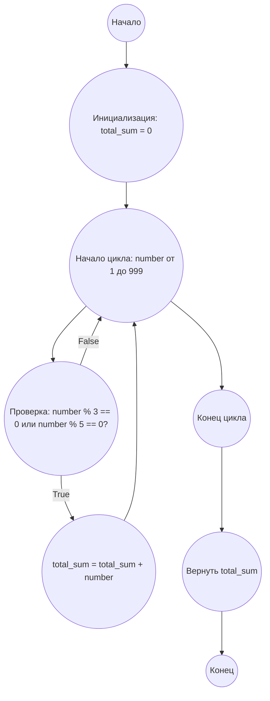

## Ответ на Задачу No 1: Сумма кратных 3 или 5

### 1. Анализ задачи и решение
**Понимание задачи:**
* Необходимо найти сумму всех натуральных чисел, меньших 1000, которые делятся на 3 или 5 без остатка.
* Это означает, что нам нужно проверить каждое число от 1 до 999 на делимость на 3 или 5 и просуммировать те, которые удовлетворяют условию.

**Решение:**
1. **Инициализация:** Задаем переменную `total_sum` для хранения суммы и устанавливаем ее начальное значение равным 0.
2. **Цикл:** Перебираем числа в диапазоне от 1 до 999 (включительно, так как нужно меньше 1000, то 999 включительно).
3. **Проверка делимости:** Для каждого числа проверяем, делится ли оно на 3 или на 5 без остатка, используя оператор `%`.
4. **Суммирование:** Если условие делимости выполняется, добавляем текущее число к `total_sum`.
5. **Возврат результата:** После завершения цикла возвращаем накопленную сумму `total_sum`.

### 2. Алгоритм решения
1. Начать
2. Инициализировать переменную `total_sum` равной 0.
3. Начать цикл для `number` от 1 до 999:
    *  Если `number` делится на 3 без остатка ИЛИ `number` делится на 5 без остатка:
       * Добавить `number` к `total_sum`
4. Вернуть `total_sum`
5. Конец

### 3. Реализация на Python 3.12
```python
def sum_multiples_of_3_and_5(limit):
    """
    Calculates the sum of all multiples of 3 or 5 below the given limit.

    Args:
        limit (int): The upper bound (exclusive).

    Returns:
        int: The sum of multiples.
    """
    total_sum = 0
    for number in range(1, limit):
        if number % 3 == 0 or number % 5 == 0:
            total_sum += number
    return total_sum

result = sum_multiples_of_3_and_5(1000)
print(result)
```

### 4. Блок-схема в формате mermaid


**Легенда:**
*   **Начало, Конец:** Начало и конец выполнения алгоритма.
*   **Инициализация: total_sum = 0:** Установка начального значения переменной `total_sum` равным 0.
*   **Начало цикла: number от 1 до 999:** Начало цикла, где переменная `number` принимает значения от 1 до 999.
*   **Проверка: number % 3 == 0 или number % 5 == 0?** Проверка условия делимости числа `number` на 3 или 5 без остатка.
*   **total_sum = total_sum + number:** Если условие истинно, то к `total_sum` прибавляется значение `number`.
*   **Конец цикла:** Завершение цикла перебора чисел.
*   **Вернуть total_sum:** Возврат значения накопленной суммы.
