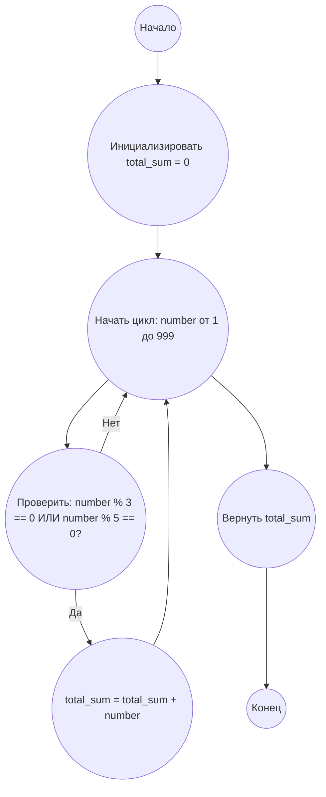

## Ответ на Задачу No 1: Сумма кратных 3 или 5

### 1. Анализ задачи и решение
**Понимание задачи:**
* Необходимо найти сумму всех натуральных чисел, меньших 1000, которые делятся на 3 или на 5.
* Это означает, что нужно перебрать все числа от 1 до 999 включительно, проверить каждое на делимость на 3 или 5, и если условие выполняется, добавить это число к общей сумме.

**Решение:**
1. **Инициализация:** Начинаем с переменной `total_sum`, которая будет хранить сумму чисел, кратных 3 или 5. Изначально она равна 0.
2. **Цикл:**  Перебираем все числа в диапазоне от 1 до 999 (не включая 1000).
3. **Проверка делимости:** Для каждого числа проверяем, делится ли оно на 3 или 5 без остатка. Это делается с помощью оператора `%` (остаток от деления). Если остаток от деления на 3 равен 0, или остаток от деления на 5 равен 0, то число удовлетворяет условию.
4. **Накопление суммы:** Если число кратно 3 или 5, то добавляем его значение к переменной `total_sum`.
5. **Возврат результата:** После завершения цикла возвращаем значение переменной `total_sum`.

### 2. Алгоритм решения
1. Начать
2. Инициализировать переменную `total_sum` равной 0
3. Для каждого числа `number` от 1 до 999:
   * Если `number` делится на 3 без остатка ИЛИ `number` делится на 5 без остатка:
     * Добавить `number` к `total_sum`
4. Вернуть значение `total_sum`
5. Конец

### 3. Реализация на Python 3.12
```python
def sum_multiples_of_3_or_5(limit):
    """
    Calculates the sum of all multiples of 3 or 5 below the given limit.

    Args:
        limit: The upper bound (exclusive).

    Returns:
        The sum of multiples.
    """
    total_sum = 0
    for number in range(1, limit):
        if number % 3 == 0 or number % 5 == 0:
            total_sum += number
    return total_sum

# Example usage:
result = sum_multiples_of_3_or_5(1000)
print(result)
```

### 4. Блок-схема в формате mermaid


**Легенда:**
*   **Начало:** Начало выполнения алгоритма.
*   **Инициализировать total_sum = 0:**  Присваиваем начальное значение 0 переменной `total_sum`, предназначенной для хранения суммы.
*   **Начать цикл: number от 1 до 999:** Начало цикла, где переменная `number` принимает все целочисленные значения от 1 до 999.
*  **Проверить: number % 3 == 0 ИЛИ number % 5 == 0?:**  Проверяем, делится ли текущее число `number` на 3 или на 5 без остатка.
*   **total_sum = total_sum + number:** Если условие проверки истинно, то текущее число `number` добавляется к общей сумме.
*   **Вернуть total_sum:** Возвращает результат, то есть вычисленную сумму чисел.
*   **Конец:** Конец выполнения алгоритма.
