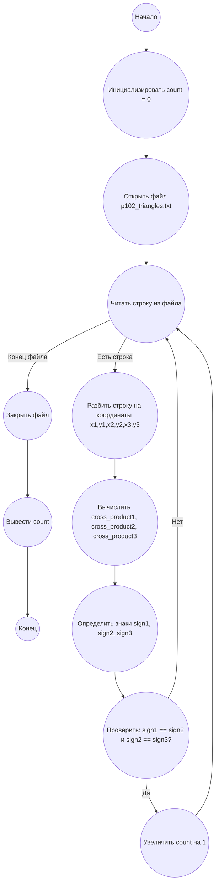

## Ответ на Задачу No 102: Треугольники, содержащие начало координат

### 1. Анализ задачи и решение
**Понимание задачи:**
* Нам даны координаты трех точек, образующих треугольник.
* Нужно определить, содержит ли данный треугольник начало координат (0, 0), при этом начало координат считается внутри треугольника, если оно находится внутри, на стороне или совпадает с одной из вершин.
* Необходимо проанализировать 1000 треугольников, координаты которых предоставлены в файле `p102_triangles.txt`, и посчитать, сколько из них содержат начало координат.

**Решение:**
1. **Идея:** Для проверки принадлежности точки (0,0) треугольнику, можно воспользоваться методом векторных произведений. Для треугольника с вершинами A(x1, y1), B(x2, y2), C(x3, y3), проверим знаки векторных произведений:
    - (B - A) x (0 - A)
    - (C - B) x (0 - B)
    - (A - C) x (0 - C)
   Если все произведения имеют одинаковый знак (все положительные или все отрицательные или все равны нулю), то точка (0,0) находится внутри треугольника, на его стороне или является вершиной.
2. **Реализация:**
    - Считываем данные из файла `p102_triangles.txt`, разделяя координаты каждой вершины.
    - Для каждого треугольника вычисляем векторные произведения.
    - Проверяем знаки полученных произведений.
    - Если все знаки одинаковы, увеличиваем счетчик.
    - Возвращаем общее количество треугольников, содержащих начало координат.

### 2. Алгоритм решения
1. Начать
2. Инициализировать `count` со значением 0.
3. Открыть файл `p102_triangles.txt` для чтения.
4. Для каждой строки в файле:
   - Разбить строку на координаты x1, y1, x2, y2, x3, y3.
   - Вычислить векторные произведения:
       - `cross_product1 = (x2 - x1) * (0 - y1) - (y2 - y1) * (0 - x1)`
       - `cross_product2 = (x3 - x2) * (0 - y2) - (y3 - y2) * (0 - x2)`
       - `cross_product3 = (x1 - x3) * (0 - y3) - (y1 - y3) * (0 - x3)`
   - Определить знаки векторных произведений (1, -1, 0):
      - `sign1 = sign(cross_product1)`
      - `sign2 = sign(cross_product2)`
      - `sign3 = sign(cross_product3)`
   - Если `(sign1 == sign2) и (sign2 == sign3)`, то увеличить счетчик `count` на 1.
5. Закрыть файл.
6. Вернуть `count`
7. Конец.
### 3. Реализация на Python 3.12
```python
def calculate_cross_product(x1, y1, x2, y2):
    """Calculates the cross product of two vectors."""
    return x1 * y2 - x2 * y1


def sign(x):
    """Returns the sign of a number."""
    if x > 0:
        return 1
    if x < 0:
        return -1
    return 0

def contains_origin(x1, y1, x2, y2, x3, y3):
    """Checks if a triangle contains the origin."""

    cross_product1 = calculate_cross_product(x2 - x1, y2 - y1, -x1, -y1)
    cross_product2 = calculate_cross_product(x3 - x2, y3 - y2, -x2, -y2)
    cross_product3 = calculate_cross_product(x1 - x3, y1 - y3, -x3, -y3)

    sign1 = sign(cross_product1)
    sign2 = sign(cross_product2)
    sign3 = sign(cross_product3)

    return (sign1 == sign2) and (sign2 == sign3)

def count_triangles_containing_origin(file_path):
    """Counts the number of triangles that contain the origin."""
    count = 0
    with open(file_path, 'r') as file:
        for line in file:
            coords = list(map(int, line.strip().split(',')))
            x1, y1, x2, y2, x3, y3 = coords
            if contains_origin(x1, y1, x2, y2, x3, y3):
                count += 1
    return count


file_path = 'p102_triangles.txt'
result = count_triangles_containing_origin(file_path)
print(result)
```

### 4. Блок-схема в формате mermaid


**Легенда:**
* **Начало, Конец:** Начало и конец алгоритма.
* **Инициализировать count = 0:**  Устанавливаем начальное значение счетчика треугольников, содержащих начало координат, равным нулю.
* **Открыть файл p102_triangles.txt:** Открываем файл для чтения координат треугольников.
* **Читать строку из файла:** Читаем очередную строку из файла, содержащую координаты одного треугольника.
* **Конец файла:** Условие проверки, достигнут ли конец файла.
* **Закрыть файл:** Закрываем открытый файл.
* **Вывести count:** Выводим общее количество треугольников, содержащих начало координат.
* **Разбить строку на координаты x1,y1,x2,y2,x3,y3:**  Разделяем строку на отдельные координаты вершин треугольника.
* **Вычислить cross_product1, cross_product2, cross_product3:**  Вычисляем векторные произведения.
* **Определить знаки sign1, sign2, sign3:** Определяем знаки вычисленных векторных произведений.
* **Проверить: sign1 == sign2 и sign2 == sign3?** Проверяем, все ли векторные произведения имеют одинаковый знак.
* **Увеличить count на 1:** Увеличиваем счетчик на единицу, если треугольник содержит начало координат.
