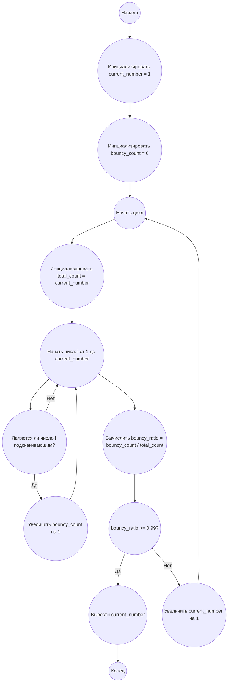

## Ответ на Задачу No 112: Подскакивающие числа

### 1. Анализ задачи и решение
**Понимание задачи:**
* Необходимо найти наименьшее натуральное число `N`, для которого отношение количества "подскакивающих" чисел к общему количеству натуральных чисел от 1 до `N` составляет ровно 99%.
* "Подскакивающим" числом называется такое число, цифры которого не образуют ни возрастающую, ни убывающую последовательность.
* Для решения нужно уметь определять, является ли число "подскакивающим" и перебирать числа, пока не выполнится условие 99%.

**Решение:**
1. **Функция проверки "подскакивания":** Создадим функцию `is_bouncy(number)`, которая будет определять, является ли заданное число "подскакивающим".
   *  Преобразуем число в строку для удобного доступа к цифрам.
   *  Проверим, является ли последовательность цифр возрастающей или убывающей. Если ни то ни другое, значит, число "подскакивающее".
2. **Основной цикл:**
   *  Начнем с числа 1 и будем увеличивать его.
   *  Для каждого числа подсчитываем общее количество чисел от 1 до текущего числа (`total_count`) и количество "подскакивающих" чисел (`bouncy_count`).
   *  Вычисляем отношение `bouncy_count / total_count`.
   *  Как только это отношение станет равным или превысит 0.99, завершаем цикл.
   *  Возвращаем текущее число `N`.

### 2. Алгоритм решения
1.  Начать
2.  Инициализировать `current_number` = 1
3.  Инициализировать `bouncy_count` = 0
4.  Начать цикл:
    *  Инициализировать `total_count` = `current_number`
    *  Для каждого числа `i` от 1 до `current_number`
        * Если `is_bouncy(i)` - истина,  увеличить `bouncy_count` на 1
    *  Вычислить `bouncy_ratio` = `bouncy_count` / `total_count`
    * Если `bouncy_ratio` >= 0.99, перейти к шагу 5
    *  Увеличить `current_number` на 1
5.  Вернуть `current_number`
6.  Конец

### 3. Реализация на Python 3.12
```python
def is_bouncy(number):
  """Checks if a number is bouncy."""
  s_number = str(number)
  if len(s_number) <= 2:
      return False

  increasing = True
  decreasing = True

  for i in range(1, len(s_number)):
      if int(s_number[i]) > int(s_number[i-1]):
          decreasing = False
      if int(s_number[i]) < int(s_number[i-1]):
          increasing = False
  
  return not increasing and not decreasing

def find_min_number_for_bouncy_ratio(target_ratio):
  """Finds the smallest number with a given ratio of bouncy numbers."""
  current_number = 1
  bouncy_count = 0

  while True:
      total_count = current_number
      bouncy_count = 0
      for i in range(1, current_number + 1):
        if is_bouncy(i):
          bouncy_count += 1
      bouncy_ratio = bouncy_count / total_count
      if bouncy_ratio >= target_ratio:
          return current_number
      current_number += 1

# Example usage
target = 0.99
result = find_min_number_for_bouncy_ratio(target)
print(result)
```

### 4. Блок-схема в формате mermaid


**Легенда:**
* **Начало, Конец:** Начало и конец алгоритма.
* **Инициализировать current_number = 1:** Устанавливаем начальное значение для текущего числа.
* **Инициализировать bouncy_count = 0:** Устанавливаем начальное количество "подскакивающих" чисел.
* **Начать цикл:** Начало основного цикла, который перебирает числа до достижения нужного отношения.
*  **Инициализировать total_count = current_number:** Устанавливаем общее количество чисел до текущего.
* **Начать цикл: i от 1 до current_number:**  Начало цикла для перебора чисел от 1 до текущего числа.
* **Является ли число i подскакивающим?:** Проверяем, является ли текущее число "подскакивающим".
* **Увеличить bouncy_count на 1:** Увеличиваем счетчик "подскакивающих" чисел, если условие выше истинно.
* **Вычислить bouncy_ratio = bouncy_count / total_count:** Вычисляем отношение "подскакивающих" чисел к общему количеству.
* **bouncy_ratio >= 0.99?:** Проверяем достигнут ли нужный процент.
* **Вывести current_number:** Выводим найденное число.
* **Увеличить current_number на 1:** Переходим к следующему числу, если условие не выполнено.
