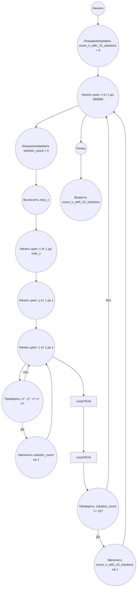

## Ответ на Задачу No 135: Разность квадратов

### 1. Анализ задачи и решение

**Понимание задачи:**
*   Нам дано уравнение `x² - y² - z² = n`.
*   Необходимо найти количество значений `n` в диапазоне `0 < n < 1000000`, для которых существует ровно 10 различных решений в натуральных числах `x`, `y`, и `z`.
*   Решения вида `(x, y, z)` и `(x, z, y)` считаются разными, если `y != z`.

**Решение:**

1.  **Перебор значений n:** Необходимо перебрать все значения `n` от 1 до 999999.
2.  **Поиск решений для каждого n:** Для каждого `n` нужно перебрать возможные значения `x`, `y`, и `z` и проверить, удовлетворяют ли они уравнению.
3.  **Счетчик решений:** Подсчитать количество уникальных решений для каждого `n`.
4.  **Подсчет n с 10 решениями:** Если количество решений для текущего `n` равно 10, увеличить счетчик таких `n`.
5.  **Ограничения перебора:**
    *   Поскольку `x² = n + y² + z²`, то `x` всегда больше, чем `y` и `z`.
    *   Максимальное значение для `x` можно ограничить, исходя из того, что `x²` должно быть меньше чем `n + (n/2)^2 + (n/2)^2`, так как `y` и `z` могут иметь значения в диапазоне от 1 до n/2, для оптимизации перебора.
    *   Для y и z мы будем итерироваться от 1 до x, так как они не могут быть больше x.

### 2. Алгоритм решения

1.  Начать
2.  Инициализировать переменную `count_n_with_10_solutions` со значением 0.
3.  Для каждого `n` от 1 до 999999:
    *   Инициализировать переменную `solution_count` со значением 0.
    *   Найти максимальное значение для x.
    *   Для каждого `x` от 1 до макс. `x`:
          *  Для каждого `y` от 1 до `x`:
              *    Для каждого `z` от 1 до `x`:
                     *   Если `x² - y² - z² = n`:
                            *  Увеличить `solution_count` на 1.
    *   Если `solution_count` равно 10:
          *   Увеличить `count_n_with_10_solutions` на 1.
4.  Вернуть `count_n_with_10_solutions`.
5.  Конец

### 3. Реализация на Python 3.12

```python
def count_n_with_ten_solutions(limit):
    """
    Counts the number of n values (0 < n < limit) for which there are exactly 10 solutions
    to the equation x² - y² - z² = n, where x, y, and z are natural numbers.

    Args:
        limit: The upper bound for n (exclusive).

    Returns:
        The count of n values with exactly 10 solutions.
    """

    count_n_with_10_solutions = 0

    for n in range(1, limit):
        solution_count = 0
        max_x = int((n + n**2/2)**0.5)+1

        for x in range(1, max_x):
            for y in range(1, x):
                for z in range(1, x):
                     if x**2 - y**2 - z**2 == n:
                        solution_count += 1

        if solution_count == 10:
            count_n_with_10_solutions += 1

    return count_n_with_10_solutions


# Example usage:
result = count_n_with_ten_solutions(1000000)
print(result)
```

### 4. Блок-схема в формате mermaid



**Legenda:**

*   **Начало, Конец:** Начало и конец алгоритма.
*   **Инициализировать `count_n_with_10_solutions` = 0:** Инициализация счетчика `n` со значением 0.
*    **Начать цикл: n от 1 до 999999:**  Цикл для перебора всех n в заданном диапазоне.
*   **Инициализировать `solution_count` = 0:** Сбрасывает счетчик решений для каждого `n`.
*   **Вычислить `max_x`:** Вычисляет максимальное значение x для текущего `n`.
*   **Начать цикл: x от 1 до `max_x`:** Цикл для перебора `x`.
*   **Начать цикл: y от 1 до x:** Цикл для перебора `y`.
*   **Начать цикл: z от 1 до x:** Цикл для перебора `z`.
*   **Проверить: `x² - y² - z² == n?`:** Проверка удовлетворения уравнения.
*   **Увеличить `solution_count` на 1:** Увеличивает счетчик решений, если уравнение выполняется.
*   **Проверить: `solution_count == 10?`:** Проверяет, равно ли количество решений 10 для данного `n`.
*   **Увеличить `count_n_with_10_solutions` на 1:** Увеличивает счетчик `n` с 10 решениями, если условие выполняется.
*   **Вывести `count_n_with_10_solutions`:** Возвращает итоговое количество `n`.
