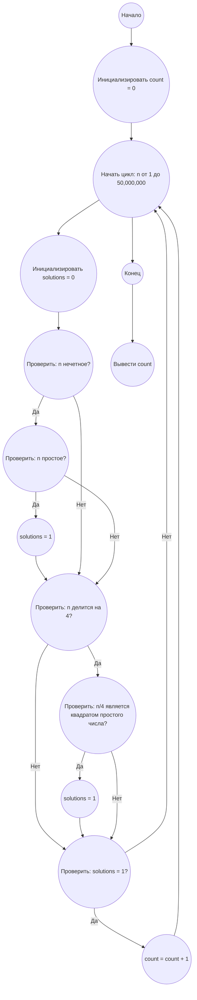

## Ответ на Задачу No 136: Одиночные решения

### 1. Анализ задачи и решение
**Понимание задачи:**
* Нам дано диофантово уравнение `x² - y² = n`, где `x`, `y` и `n` - натуральные числа.
* Необходимо найти количество натуральных чисел `n` < 50 000 000, для которых уравнение имеет ровно одно решение.
* Уравнение можно переписать как `(x - y)(x + y) = n`. Обозначим `a = x - y` и `b = x + y`, тогда `a * b = n`.
* Выразим `x` и `y` через `a` и `b`:  `x = (a + b) / 2` и `y = (b - a) / 2`. Поскольку `x` и `y` натуральные, то `a` и `b` должны быть натуральными,  `b > a`, а также должны быть либо оба четные, либо оба нечетные (чтобы `(a + b)` и `(b - a)` были четными).
* Это значит, что если `n` нечетное, то `a` и `b` всегда нечетные, а если `n` четное, то `a` и `b` всегда четные.
* В случае если n нечетное, то  `n = (2k + 1)(2m + 1) = 4km + 2k + 2m + 1`. Т.е. `n` -  произведение двух нечетных чисел.
* Если n = 4k, то a и b четные. n = (2k)*(2m), где k * m = n/4
* Если n = 4k+2, то нет решений. Потому что если n четное, то а и б четные, тогда их произведение делится на 4.
*  Единственное решение существует, если `n`  либо простое, большее 2 , либо является квадратом простого числа помноженного на 4 (n=4p^2)

**Решение:**
1.  Инициализируем счетчик `count` для количества n с единственным решением.
2.  Перебираем все `n` от 1 до 50 000 000.
3.  Для каждого `n` вычисляем количество решений `f(n)`.
4.  Если `f(n)` равно 1, увеличиваем счетчик `count`.
5.  Возвращаем значение `count`.

**Вычисление f(n):**
1. Если n четное и не делится на 4 , возвращаем 0.
2. Если n = 4k, то n = (x-y)(x+y), тогда x-y и x+y четные. Значит, нужно посчитать количество делителей n/4
3. Если n нечетное, то нужно посчитать количество делителей n.
4.  Количество решений будет равно количеству пар делителей `(a, b)`, где `a * b = n` , `a < b`, и a, b либо оба четные, либо оба нечетные, делённое на 2 (т.к. `(a,b)` и `(b,a)` соответствуют одному решению).
5.  Количество таких пар равно `(количество_делителей(n) - 1) / 2` для нечетных и `(количество_делителей(n/4) - 1) / 2` для n = 4k если количество делителей нечетное, то это значит, что n - квадрат числа и значит не будет единственного решения. Нам нужно лишь n, которые являются простыми или квадратами простых, умноженных на 4.

### 2. Алгоритм решения
1. Начать
2. Инициализировать `count = 0`.
3. Для каждого `n` от 1 до 50 000 000:
   *   Инициализировать `solutions = 0`.
   *   Если `n` нечетное:
       *   Если `n` простое, то `solutions = 1`
   *   Если `n` делится на 4
        *    Если n/4 = квадрат простого, то  `solutions = 1`.
    *    Если `solutions = 1` , то count  увеличить на 1.
4. Вернуть `count`
5. Конец

### 3. Реализация на Python 3.12
```python
import math

def is_prime(n):
    if n < 2:
        return False
    for i in range(2, int(math.sqrt(n)) + 1):
        if n % i == 0:
            return False
    return True

def is_square(n):
  if n < 0:
        return False
  root = int(math.sqrt(n))
  return root * root == n

def solve():
    limit = 50_000_000
    count = 0
    for n in range(1, limit):
        solutions = 0
        if n % 2 != 0:
            if is_prime(n):
               solutions = 1

        elif n % 4 == 0:
            if is_square(n//4) and is_prime(int(math.sqrt(n//4))):
                solutions = 1

        if solutions == 1:
           count += 1

    return count

result = solve()
print(result)
```

### 4. Блок-схема в формате mermaid

**Legenda:**
* **Начало, Конец:** Начало и конец алгоритма.
* **Инициализировать count = 0:** Устанавливаем счетчик количества n, для которых f(n)=1, в 0.
* **Начать цикл: n от 1 до 50,000,000:** Начало цикла для перебора всех n в заданном диапазоне.
* **Инициализировать solutions = 0:** Инициализируем переменную для хранения количества решений текущего n.
*  **Проверить: n нечетное?:** Проверяем, является ли текущее n нечетным.
*  **Проверить: n простое?:** Проверяем, является ли текущее n простым.
* **solutions = 1:** Присваиваем переменной solutions значение 1, если n удовлетворяет условию.
* **Проверить: n делится на 4?:** Проверяем, делится ли текущее n на 4.
* **Проверить: n/4 является квадратом простого числа?:** Проверяем, является ли n/4 квадратом простого числа.
* **Проверить: solutions = 1?:** Проверяем, равно ли solutions 1.
* **count = count + 1:** Если solutions = 1, увеличиваем счетчик на 1.
* **Вывести count:** Выводим значение счетчика count.
