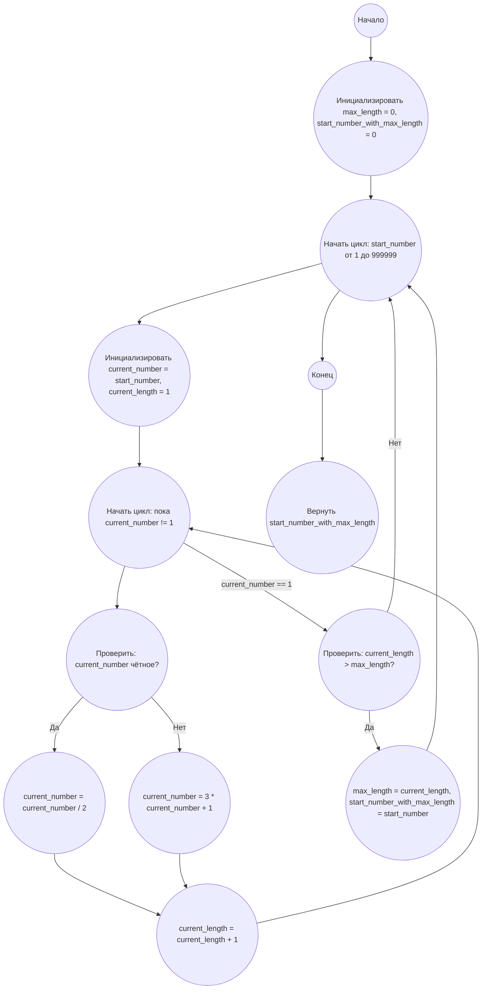

## Ответ на Задачу No 14: Самая длинная последовательность Коллатца

### 1. Анализ задачи и решение
**Понимание задачи:**
* Задача заключается в нахождении начального числа (меньше миллиона), которое порождает самую длинную последовательность Коллатца, до достижения 1.
* Последовательность строится по правилу: если число чётное, делим на 2; если нечётное, умножаем на 3 и прибавляем 1.
* Необходимо перебрать все начальные числа от 1 до 999999, рассчитать длину последовательности для каждого, и найти число с максимальной длиной.

**Решение:**
1. **Функция расчета длины последовательности:** Создаем функцию, которая принимает начальное число и возвращает длину последовательности Коллатца.
2. **Перебор начальных чисел:** Перебираем числа от 1 до 999999.
3. **Расчет длины и сравнение:** Для каждого начального числа вычисляем длину последовательности, сравниваем с максимальной длиной, и если текущая длина больше, то обновляем максимальную длину и соответствующее начальное число.
4. **Возврат результата:** После окончания перебора возвращаем начальное число с максимальной длиной последовательности.

### 2. Алгоритм решения
1. Начать.
2. Инициализировать `max_length` = 0 и `start_number_with_max_length` = 0.
3. Для каждого числа `start_number` от 1 до 999999:
   - Инициализировать `current_number` = `start_number`.
   - Инициализировать `current_length` = 1.
   - Пока `current_number` != 1:
     - Если `current_number` чётное:
       - `current_number` = `current_number` / 2.
     - Иначе:
       - `current_number` = 3 * `current_number` + 1.
     - Увеличить `current_length` на 1.
   - Если `current_length` > `max_length`:
     - `max_length` = `current_length`.
     - `start_number_with_max_length` = `start_number`.
4. Вернуть `start_number_with_max_length`.
5. Конец.

### 3. Реализация на Python 3.12
```python
def collatz_sequence_length(start_number):
    """
    Calculates the length of the Collatz sequence starting from a given number.

    Args:
        start_number: The starting number for the Collatz sequence.

    Returns:
        The length of the Collatz sequence.
    """
    current_number = start_number
    length = 1
    while current_number != 1:
        if current_number % 2 == 0:
            current_number //= 2
        else:
            current_number = 3 * current_number + 1
        length += 1
    return length

def find_longest_collatz_sequence(limit):
    """
    Finds the starting number below the given limit that produces the longest Collatz sequence.

    Args:
        limit: The upper bound (exclusive) for starting numbers.

    Returns:
        The starting number with the longest Collatz sequence.
    """
    max_length = 0
    start_number_with_max_length = 0
    for start_number in range(1, limit):
        current_length = collatz_sequence_length(start_number)
        if current_length > max_length:
            max_length = current_length
            start_number_with_max_length = start_number
    return start_number_with_max_length

# Пример использования:
limit = 1000000
result = find_longest_collatz_sequence(limit)
print(result)
```

### 4. Блок-схема в формате mermaid


**Легенда:**

* **Начало, Конец:** Начало и конец алгоритма.
* **Инициализировать max_length = 0, start_number_with_max_length = 0:** Инициализируются переменные для хранения максимальной длины последовательности и начального числа, которое ее порождает.
* **Начать цикл: start_number от 1 до 999999:** Начало цикла, перебирающего все начальные числа до 1 миллиона.
* **Инициализировать current_number = start_number, current_length = 1:** Инициализация переменных для текущей последовательности Коллатца.
* **Начать цикл: пока current_number != 1:** Начало цикла, генерирующего последовательность Коллатца.
* **Проверить: current_number чётное?:** Проверка текущего числа на четность.
* **current_number = current_number / 2:** Если число четное, делим его на 2.
* **current_number = 3 * current_number + 1:** Если число нечетное, применяем соответствующее правило.
* **current_length = current_length + 1:** Увеличиваем длину последовательности на 1.
* **Проверить: current_length > max_length?:** Проверяем, если текущая длина последовательности больше максимальной.
* **max_length = current_length, start_number_with_max_length = start_number:** Обновляем максимальную длину последовательности и начальное число.
* **Вернуть start_number_with_max_length:** Возвращаем начальное число, которое порождает самую длинную последовательность Коллатца.
