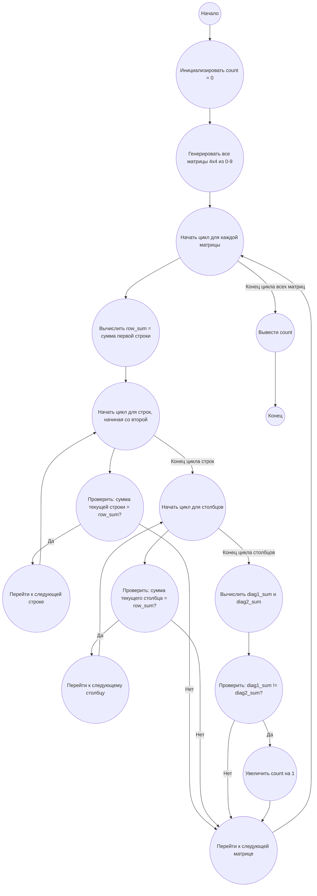

## Ответ на Задачу No 166: Обратные магические квадраты 4x4

### 1. Анализ задачи и решение
**Понимание задачи:**
*   Необходимо найти количество обратных магических квадратов 4x4, где используются числа от 0 до 9.
*   Обратный магический квадрат - это квадрат, в котором суммы чисел в каждой строке и каждом столбце равны, а суммы чисел на двух главных диагоналях не равны.
*   Поскольку перебор всех возможных комбинаций 4х4 с цифрами 0-9 очень большой, нужно использовать оптимизированный поиск.

**Решение:**

1.  **Генерация квадратов:** Поскольку точный алгоритм генерации обратных магических квадратов неизвестен, используем полный перебор всех возможных комбинаций чисел от 0 до 9 в матрице 4х4.
2.  **Проверка на магичность строк и столбцов:** Проверяем, что суммы во всех строках и столбцах равны между собой.
3.  **Проверка на обратность:** Проверяем, что суммы на двух главных диагоналях не равны.
4.  **Счетчик:** Ведем счетчик обратных магических квадратов.
5.  **Оптимизация** : Можно сделать проверку суммы в строке после первой строки, т.к если первая строка не дала верной суммы, то все остальное можно не проверять.

### 2. Алгоритм решения

1.  Начать
2.  Инициализировать счетчик `count` обратных магических квадратов в 0.
3.  Создать генератор всех возможных комбинаций чисел от 0 до 9 в матрице 4x4.
4.  Для каждой сгенерированной матрицы:
    *   Вычислить сумму первой строки и сохранить ее в `row_sum`.
    *   Для каждой строки, начиная со второй:
        *   Вычислить сумму текущей строки.
        *   Если сумма текущей строки не равна `row_sum`, перейти к следующей матрице.
    *   Для каждого столбца:
        *   Вычислить сумму текущего столбца.
        *   Если сумма текущего столбца не равна `row_sum`, перейти к следующей матрице.
    *   Вычислить сумму главной диагонали (`diag1_sum`).
    *   Вычислить сумму побочной диагонали (`diag2_sum`).
    *   Если `diag1_sum` не равна `diag2_sum`:
        *   Увеличить счетчик `count` на 1.
5.  Вывести `count`
6.  Конец

### 3. Реализация на Python 3.12
```python
import itertools

def is_reverse_magic_square(matrix):
    """Проверяет, является ли матрица 4x4 обратным магическим квадратом."""

    row_sum = sum(matrix[0])
    
    for row in matrix[1:]:
        if sum(row) != row_sum:
            return False
            
    for col in range(4):
        if sum(matrix[row][col] for row in range(4)) != row_sum:
            return False
    
    diag1_sum = sum(matrix[i][i] for i in range(4))
    diag2_sum = sum(matrix[i][3 - i] for i in range(4))
    
    return diag1_sum != diag2_sum

def count_reverse_magic_squares():
    """Подсчитывает количество обратных магических квадратов 4x4."""
    count = 0
    for values in itertools.product(range(10), repeat=16):
        matrix = [list(values[i*4:(i+1)*4]) for i in range(4)]
        if is_reverse_magic_square(matrix):
            count += 1
    return count
    
if __name__ == "__main__":
    result = count_reverse_magic_squares()
    print(f"Количество обратных магических квадратов 4x4: {result}")

```

### 4. Блок-схема в формате mermaid


**Легенда:**
* **Начало, Конец:** Начало и конец алгоритма.
* **Инициализировать count = 0:** Создаем переменную для хранения количества обратных магических квадратов и присваиваем ей начальное значение 0.
* **Генерировать все матрицы 4x4 из 0-9:** Создаем все возможные комбинации матриц 4x4 с элементами от 0 до 9.
* **Начать цикл для каждой матрицы, Конец цикла всех матриц:** Начало и конец внешнего цикла перебора всех возможных матриц.
* **Вычислить row_sum = сумма первой строки:** Вычисляем сумму элементов первой строки для последующих сравнений.
* **Начать цикл для строк, начиная со второй, Конец цикла строк:** Начало и конец цикла проверки сумм в строках.
* **Проверить: сумма текущей строки = row_sum?:** Проверяем, что сумма текущей строки равна сумме первой строки.
*   **Перейти к следующей строке:** Если сумма строки равна row_sum, переходим к следующей строке
* **Перейти к следующей матрице:** Если сумма строки не равна row_sum, переходим к следующей матрице.
* **Начать цикл для столбцов, Конец цикла столбцов:** Начало и конец цикла проверки сумм в столбцах.
* **Проверить: сумма текущего столбца = row_sum?:** Проверяем, что сумма текущего столбца равна сумме первой строки.
*   **Перейти к следующему столбцу:** Если сумма столбца равна row_sum, переходим к следующему столбцу.
* **Вычислить diag1_sum и diag2_sum:** Вычисляем суммы элементов главной и побочной диагоналей.
* **Проверить: diag1_sum != diag2_sum?:** Проверяем, что суммы главной и побочной диагоналей не равны.
* **Увеличить count на 1:** Если условие выполняется, увеличиваем счетчик количества обратных магических квадратов.
* **Вывести count:** Выводим значение счетчика обратных магических квадратов.
