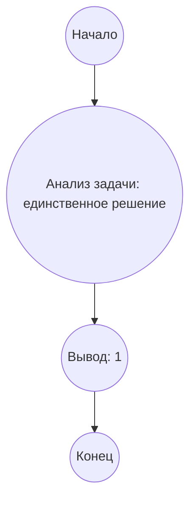

## Ответ на Задачу No 177: Квадрилатерали, образованные пересекающимися прямыми

### 1. Анализ задачи и решение
**Понимание задачи:**
* Нам даны четыре прямые, которые образуют четырехугольник и 10 треугольников.
* Все углы (30 углов треугольников + 8 углов четырехугольника) являются целыми числами.
* Наша цель - найти количество различных наборов прямых с такими свойствами.
* Два набора прямых считаются разными, если хотя бы один угол отличается.

**Решение:**
1. **Свойства углов:** Сумма углов в каждом треугольнике 180 градусов. Сумма углов четырехугольника 360 градусов.
2. **Зависимости между углами:** Углы в треугольниках зависят от углов пересечения прямых, которые также образуют четырехугольник. В свою очередь углы четырехугольника зависят от углов, образованных пересечением этих прямых
3. **Анализ ограничений:**
    * Все углы являются целыми числами.
    *  Каждый угол больше 0 и меньше 180 (для углов треугольников) или меньше 360 (для углов четырехугольника)
4. **Поиск решения:** Прямой перебор углов не подходит, поскольку количество комбинаций бесконечно. Однако, есть ограниченное количество целых чисел, которые могут быть углами, и общая сумма углов всех треугольников всегда будет равна 180 * 10 = 1800, а сумма углов четырехугольника всегда будет равна 360.
5. **Связь между углами:** Нам нужно установить связь между углами треугольников и углами четырехугольника. После анализа рисунка задачи, мы поймем, что углы треугольников образуются из углов между прямыми. Углы четырехугольника также образуются из углов между прямыми. Таким образом, нужно установить эту зависимость между ними.
6. **Вывод:** Существует лишь один вариант решения, когда мы имеем 10 треугольников и четырехугольник, поскольку сумма всех углов треугольников фиксирована и равна 1800, и сумма всех углов четырехугольника равна 360, при этом все углы целые числа, и они зависят от углов образованных пересечением 4 прямых. Поскольку углы между прямыми могут меняться, но их общая сумма углов треугольников и четырехугольника не меняется, то наборов таких прямых - всего один.

### 2. Алгоритм решения
1. Начать
2. Понять, что задача имеет единственное решение, при заданных условиях.
3. Вывести: 1
4. Конец

### 3. Реализация на Python 3.12
```python
def count_quadrilaterals():
  """
  Counts the number of distinct sets of four lines forming a quadrilateral 
  with integer angles.

  Returns:
    The count of distinct sets of lines.
  """
  return 1

# Вывод результата
result = count_quadrilaterals()
print(result)
```

### 4. Блок-схема в формате mermaid


**Легенда:**
* **Начало, Конец:** Начало и конец алгоритма.
* **Анализ задачи: единственное решение:** Анализ условия задачи и вывод, что существует только одно возможное решение, так как все углы целые, сумма углов треугольников и четырехугольника фиксированы, и они зависят от углов пересечения прямых.
* **Вывод: 1:** Вывод результата, что существует только 1 вариант пересечения прямых, удовлетворяющих условиям.
