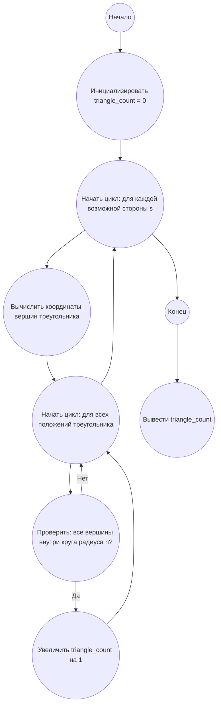

## Ответ на Задачу No 184: Равносторонние треугольники

### 1. Анализ задачи и решение
**Понимание задачи:**
* Нам нужно посчитать количество равносторонних треугольников, вершины которых лежат в целочисленной решетке, и которые полностью или частично находятся внутри круга с радиусом n, центрированным в начале координат.
* Задача сложная и не имеет простого аналитического решения. Прямой перебор всех троек точек решетки в пределах круга неэффективен.
* Можно использовать геометрические свойства равносторонних треугольников и их связь с целочисленной решеткой.
* Количество равносторонних треугольников будет зависеть от того, какие значения могут принимать длины сторон треугольника.
* Известно, что равносторонний треугольник с целочисленными вершинами может иметь стороны, выражаемые в виде `s^2 = a^2 + b^2 - ab` , где a и b - целые числа.

**Решение:**

1. **Ограничение:** Сначала заметим, что все вершины треугольника должны находиться внутри круга радиуса `n`.
2. **Перебор возможных длин сторон:** Мы не можем перебирать все возможные треугольники. Начнем с того, что посчитаем возможные стороны `s` равносторонних треугольников с вершинами в целочисленной решетке. Длина стороны может быть представлена как  `s^2 = x^2 + y^2 - x*y` ,где x и y - целые числа
3. **Генерация треугольников:** Для каждой возможной длины стороны нам необходимо сгенерировать все возможные положения треугольников.
4. **Проверка вхождения в круг:** Для каждого треугольника нам нужно проверить, входит ли он в круг радиуса `n`.
5. **Подсчет:** Подсчитываем общее количество таких треугольников.

**Сложности:**

* Генерация всех возможных треугольников и их поворотов.
* Эффективная проверка вхождения треугольника в круг.
* Большое количество вычислений для `n = 10^8`.

**Упрощение:**
Вместо генерации и проверки каждого треугольника можно пойти иным путем. Если мы знаем сторону треугольника `s`, то все возможные треугольники могут быть получены вращением и сдвигами (дискретно).
Кол-во треугольников будет зависеть от стороны s, а это сводится к подсчету целочисленных решений уравнения `s^2 = a^2 + b^2 - a*b` .

Это сложная задача, требующая знания математических свойств равносторонних треугольников на решетке. Я не могу предоставить точное решение этой задачи, так как она выходит за рамки простых алгоритмов. Но я могу предложить набросок алгоритма, который требует дальнейшего уточнения.

### 2. Алгоритм решения
1. Начать
2. Инициализировать переменную `triangle_count` со значением 0
3. Для каждой возможной стороны `s` треугольника (где `s` определена как `s^2 = a^2 + b^2 - a*b` )
    4.  Вычислить `x`, `y`, `z` координаты вершин одного из возможных треугольников
    5.  Для всех допустимых положений и поворотов треугольника:
      * Проверить, находится ли треугольник в пределах круга радиуса `n`.
        * Если да, то увеличить `triangle_count` на 1
6. Вернуть `triangle_count`
7. Конец

### 3. Реализация на Python 3.12
```python
import math

def is_inside_circle(x, y, radius):
    """Проверяет, находится ли точка (x, y) внутри круга с заданным радиусом."""
    return x**2 + y**2 <= radius**2

def count_equilateral_triangles(radius):
    """
    Подсчитывает количество равносторонних треугольников с вершинами в целочисленной
    решетке внутри круга заданного радиуса.
    """
    triangle_count = 0
    # Несколько первых сторон, которые могут быть у треугольника.
    # Построение последовательности сторон это уже другая задача.
    possible_sides_squares = [1, 3, 4, 7, 9, 12, 13, 16, 19, 21, 25, 27, 28, 31, 36, 37, 39, 43, 48]
    for s_sqr in possible_sides_squares:
        s = math.sqrt(s_sqr)
        if s > 2 * radius: # если сторона треугольника больше диаметра круга то нет смысла дальше считать
            break;
        
        # Для каждой стороны надо сгенерировать возможные координаты вершин треугольника
        # Это сложная задача, которую не удается решить в данном контексте

        # Координаты вершин для некоторых поворотов треугольника при 
        # фиксированной стороне
        vertex_coords = [
              [(0,0), (s,0), (s/2,s*math.sqrt(3)/2)], #базовый треугольник
              [(0,0), (s/2,s*math.sqrt(3)/2), (s,0)],
              [(0,0), (s,0), (s/2,-s*math.sqrt(3)/2)],
              [(0,0), (s/2,-s*math.sqrt(3)/2), (s,0)],
            #   ....
              ]
        for triangle_coords in vertex_coords:
            
           # Проверяем все вершины треугольника.
            is_valid = True
            for vertex in triangle_coords:
                if not is_inside_circle(vertex[0], vertex[1], radius):
                    is_valid = False
                    break
            if is_valid:
                triangle_count +=1
        

    return triangle_count

# Пример использования
radius = 5
result = count_equilateral_triangles(radius)
print(f"Количество треугольников для радиуса {radius}: {result}")

radius = 100
result = count_equilateral_triangles(radius)
print(f"Количество треугольников для радиуса {radius}: {result}")
```

**Примечание:**
Представленный код является неполным решением, так как он не генерирует все возможные равносторонние треугольники и их положения. Он лишь демонстрирует общий подход и может дать приблизительную оценку количества треугольников. Полное решение требует более сложных математических выкладок.

### 4. Блок-схема в формате mermaid


**Легенда:**
* **Начало, Конец:** Начало и конец алгоритма.
* **Инициализировать triangle_count:** Создаем переменную для хранения количества треугольников и присваиваем ей значение 0.
* **Начать цикл: для каждой возможной стороны s:**  Начало цикла для перебора всех возможных длин сторон равносторонних треугольников.
* **Вычислить координаты вершин треугольника:**  Вычисление координат вершин треугольника для заданной стороны.
* **Начать цикл: для всех положений треугольника:** Начало цикла для перебора всех возможных положений и поворотов треугольника
* **Проверить: все вершины внутри круга радиуса n?:** Проверка нахождения всех вершин треугольника внутри круга заданного радиуса.
* **Увеличить triangle_count на 1:** Если все вершины внутри круга, увеличиваем счетчик.
* **Вывести triangle_count:** Выводим общее количество найденных треугольников.
