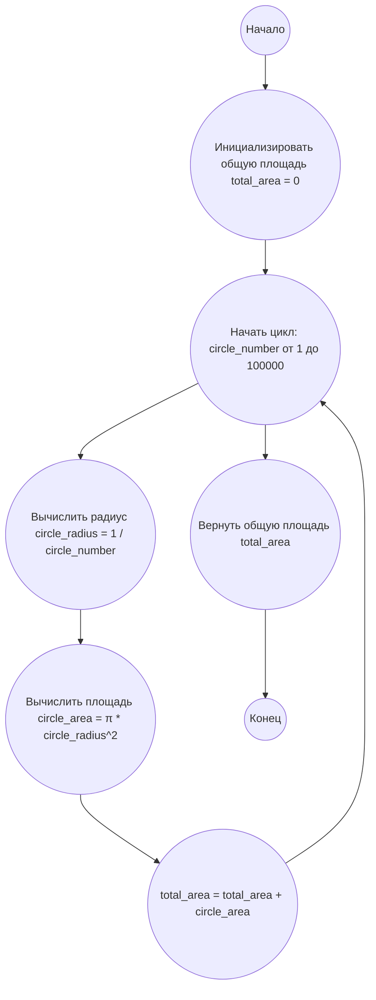

## Ответ на Задачу No 226: Перемешивание кругов

### 1. Анализ задачи и решение

**Понимание задачи:**
*   Задача заключается в нахождении общей площади кругов, которые добавляются и касаются друг друга в соответствии с заданными правилами.
*   Первый круг имеет радиус 1, следующие два - радиус 1/2, и так далее, где каждый новый круг имеет радиус 1/n, где n - порядковый номер круга.
*   Нужно найти суммарную площадь кругов от 1 до 100000.

**Решение:**
1.  **Площадь круга:** Площадь круга вычисляется по формуле π * r^2, где r - радиус круга.
2.  **Радиус круга:** Радиус каждого последующего круга равен 1/n, где n – порядковый номер круга.
3.  **Суммирование площадей:** Необходимо просуммировать площади всех кругов от 1 до 100000.
4.  **Использование π:** Для вычисления площади круга используем значение π (из модуля `math`).

### 2. Алгоритм решения

1.  Начать.
2.  Инициализировать `total_area` (общую площадь) значением 0.
3.  Для каждого числа `circle_number` от 1 до 100000:
    *   Вычислить радиус `circle_radius` как 1 / `circle_number`.
    *   Вычислить площадь `circle_area` как π * `circle_radius`^2.
    *   Добавить `circle_area` к `total_area`.
4.  Вернуть `total_area`.
5.  Конец.

### 3. Реализация на Python 3.12
```python
import math

def calculate_total_area(limit):
    """
    Calculates the total area of circles from 1 to limit, where the radius of each
    circle is 1/n, where n is the circle's number.

    Args:
        limit: The number of circles to consider.

    Returns:
        The total area of all circles.
    """
    total_area = 0
    for circle_number in range(1, limit + 1):
        circle_radius = 1 / circle_number
        circle_area = math.pi * circle_radius ** 2
        total_area += circle_area
    return total_area

# Пример использования:
total_area_100000 = calculate_total_area(100000)
print(f"{total_area_100000:.10f}")
```

### 4. Блок-схема в формате mermaid


**Legenda:**
*   **Start, End:** Начало и конец выполнения алгоритма.
*   **InitializeArea:** Инициализирует переменную `total_area`, которая будет хранить общую площадь всех кругов, начальным значением 0.
*   **LoopStart:** Начало цикла, который будет выполняться для каждого круга от 1 до 100000.
*   **CalculateRadius:** Вычисляет радиус текущего круга `circle_radius`, используя формулу 1 / `circle_number`.
*  **CalculateArea:** Вычисляет площадь текущего круга `circle_area`, используя формулу π * `circle_radius`^2.
*   **AddArea:** Добавляет площадь текущего круга `circle_area` к общей площади `total_area`.
*   **ReturnArea:** После завершения цикла, возвращает вычисленную общую площадь `total_area`.
