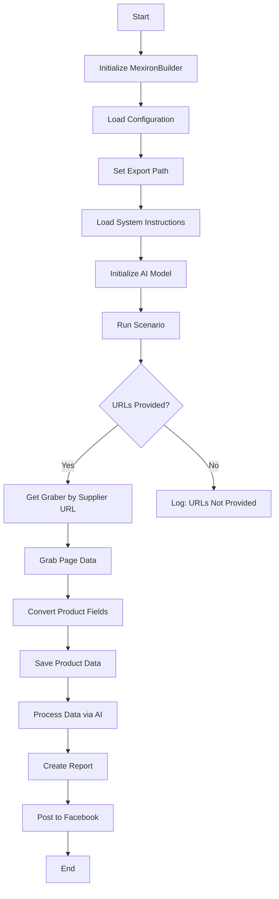

## Sergey Kazarinov's Mechiron Creation Script

### Overview

This script is part of the `hypotez/src/endpoints/kazarinov/scenarios` directory and is designed to automate the process of creating a "mechiron" for Sergey Kazarinov. The script extracts, parses, and processes product data from various suppliers, prepares the data, processes it through AI, and integrates with Facebook for product publication.

### Key Features

1. **Data Extraction and Parsing**: Extracts and parses product data from various suppliers.
2. **AI Data Processing**: Processes the extracted data through the Google Generative AI model.
3. **Data Storage**: Saves the processed data to files.
4. **Report Generation**: Generates HTML and PDF reports from the processed data.
5. **Facebook Publication**: Publishes the processed data to Facebook.

### Module Flowchart



### Legend

1. **Start**: Start of script execution.
2. **InitMexironBuilder**: Initialization of the `MexironBuilder` class.
3. **LoadConfig**: Loads configuration from a JSON file.
4. **SetExportPath**: Sets the path for data export.
5. **LoadSystemInstruction**: Loads system instructions for the AI model.
6. **InitModel**: Initializes the Google Generative AI model.
7. **RunScenario**: Executes the main scenario.
8. **CheckURLs**: Checks if URLs for parsing are provided.
9. **GetGraber**: Retrieves the appropriate graber for the supplier URL.
10. **GrabPage**: Extracts page data using the graber.
11. **ConvertFields**: Converts product fields into a dictionary.
12. **SaveData**: Saves product data to a file.
13. **ProcessAI**: Processes product data through the AI model.
14. **CreateReport**: Creates HTML and PDF reports from the processed data.
15. **PostFacebook**: Publishes the processed data to Facebook.
16. **End**: End of script execution.

-----------------------

#### Class: `MexironBuilder`

- **Attributes**:
  - `driver`: Selenium WebDriver instance.
  - `export_path`: Path for data export.
  - `mexiron_name`: Custom name for the mechiron process.
  - `price`: Price for processing.
  - `timestamp`: Timestamp for the process.
  - `products_list`: List of processed product data.
  - `model`: Google Generative AI model.
  - `config`: Configuration loaded from JSON.

- **Methods**:
  - **`__init__(self, driver: Driver, mexiron_name: Optional[str] = None)`**:
    - **Purpose**: Initializes the `MexironBuilder` class with necessary components.
    - **Parameters**:
      - `driver`: Selenium WebDriver instance.
      - `mexiron_name`: Custom name for the mechiron process.
    ----
  - **`run_scenario(self, system_instruction: Optional[str] = None, price: Optional[str] = None, mexiron_name: Optional[str] = None, urls: Optional[str | List[str]] = None, bot = None) -> bool`**:
    - **Purpose**: Executes the scenario: parses products, processes them through AI, and saves the data.
    - **Parameters**:
      - `system_instruction`: System instructions for the AI model.
      - `price`: Price for processing.
      - `mexiron_name`: Custom mechiron name.
      - `urls`: URLs of product pages.
    - **Returns**: `True` if the scenario runs successfully, otherwise `False`.

    -  **Flowchart**:
    ```mermaid
    flowchart TD
        Start[Start] --> CheckURL{URL is from OneTab?}
        CheckURL -->|Yes| FetchData[Get data from OneTab]
        CheckURL -->|No| ReplyTryAgain[Reply - Try again]
        FetchData --> ValidateData{Data valid?}
        ValidateData -->|No| ReplyIncorrectData[Reply Incorrect data]
        ValidateData -->|Yes| RunScenario[Run Mexiron scenario]
        RunScenario --> ScenarioSuccess{Scenario successful?}
        ScenarioSuccess -->|Yes| ReplyDone[Reply Done! I will send the link to WhatsApp]
        ScenarioSuccess -->|No| ReplyError[Reply Error running scenario]
        ReplyIncorrectData --> Return[Return]
        ReplyDone --> Return[Return]
        ReplyTryAgain --> Return[Return]
        ReplyError --> Return[Return]

    ```
    Legend:
    
    1.&nbsp;**Start**: Start of scenario execution. 
    
    2.&nbsp;**CheckURL**: Checks if the URL is from OneTab.  
    
    3.&nbsp;**FetchData**: Fetches data from OneTab. 
    
    4.&nbsp;**ReplyTryAgain**: Replies "Try again" if the URL is not from OneTab. 
    
    5.&nbsp;**ValidateData**: Validates the data.
    
    6.&nbsp;**ReplyIncorrectData**: Replies "Incorrect data" if the data is invalid.
    
    7.&nbsp;**RunScenario**: Runs the Mexiron scenario.
    
    8.&nbsp;**ScenarioSuccess**: Checks if the scenario ran successfully.
    
    9.&nbsp;**ReplyDone**: Replies "Done! I will send the link to WhatsApp" if the scenario is successful.

    10.&nbsp;**ReplyError**: Replies "Error running scenario" if the scenario fails.

    11.&nbsp;**Return**: Returns from the function.

----
  - **`get_graber_by_supplier_url(self, url: str)`**:
    - **Purpose**: Returns the appropriate graber for the given supplier URL.
    - **Parameters**:
      - `url`: Supplier page URL.
    - **Returns**: Graber instance if found, otherwise `None`.
----
  - **`convert_product_fields(self, f: ProductFields) -> dict`**:
    - **Purpose**: Converts product fields into a dictionary.
    - **Parameters**:
      - `f`: Object containing parsed product data.
    - **Returns**: Formatted dictionary of product data.
----
  - **`save_product_data(self, product_data: dict)`**:
    - **Purpose**: Saves product data to a file.
    - **Parameters**:
      - `product_data`: Formatted product data.
----
  - **`process_ai(self, products_list: List[str], lang: str, attempts: int = 3) -> tuple | bool`**:
    - **Purpose**: Processes a list of products through the AI model.
    - **Parameters**:
      - `products_list`: List of product data dictionaries as strings.
      - `attempts`: Number of retry attempts in case of failure.
    - **Returns**: Processed response in `ru` and `he` formats.
----
  - **`post_facebook(self, mexiron: SimpleNamespace) -> bool`**:
    - **Purpose**: Executes the Facebook publication scenario.
    - **Parameters**:
      - `mexiron`: Processed data for publication.
    - **Returns**: `True` if publication is successful, otherwise `False`.
----
  - **`create_report(self, data: dict, html_file: Path, pdf_file: Path)`**:
    - **Purpose**: Generates HTML and PDF reports from the processed data.
    - **Parameters**:
      - `data`: Processed data.
      - `html_file`: Path to save the HTML report.
      - `pdf_file`: Path to save the PDF report.

### Usage

To use this script, follow these steps:

1. **Initialize Driver**: Create an instance of the `Driver` class.
2. **Initialize MexironBuilder**: Create an instance of the `MexironBuilder` class with the driver.
3. **Run Scenario**: Call the `run_scenario` method with the necessary parameters.

#### Example

```python
from src.webdriver.driver import Driver
from src.endpoints.kazarinov.scenarios.scenario_pricelist import MexironBuilder

# Initialize Driver
driver = Driver(...)

# Initialize MexironBuilder
mexiron_builder = MexironBuilder(driver)

# Run Scenario
urls = ['https://example.com/product1', 'https://example.com/product2']
mexiron_builder.run_scenario(urls=urls)
```

### Dependencies

- `selenium`: For web automation.
- `asyncio`: For asynchronous operations.
- `pathlib`: For file path handling.
- `types`: For creating simple namespaces.
- `typing`: For type annotations.
- `src.ai.gemini`: For AI data processing.
- `src.suppliers.*.graber`: For data extraction from various suppliers.
- `src.endpoints.advertisement.facebook.scenarios`: For Facebook publication.

### Error Handling

The script includes robust error handling to ensure continued execution even if some elements are not found or if there are issues with the web page. This is particularly useful for handling dynamic or unstable web pages.

### Contribution

Contributions to this script are welcome. Please ensure that any changes are well-documented and include appropriate tests.

### License

This script is licensed under the MIT License. See the `LICENSE` file for details.