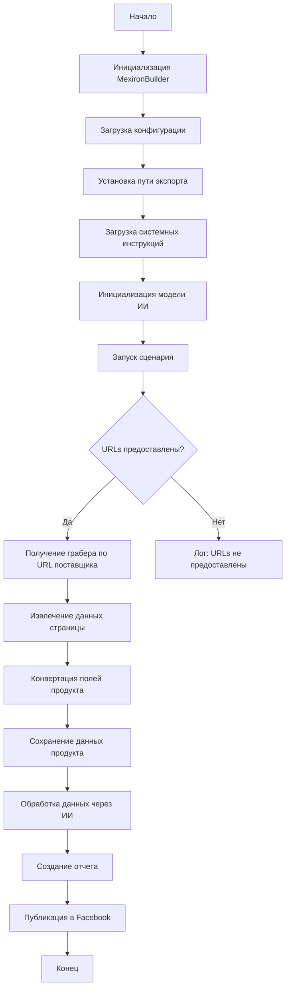

## Сценарий создания мехирона для Сергея Казаринова

### Обзор

Этот скрипт является частью директории `hypotez/src/endpoints/kazarinov/scenarios` и предназначен для автоматизации процесса создания "мехирона" для Сергея Казаринова. Скрипт извлекает, парсит и обрабатывает данные о продуктах от различных поставщиков, подготавливает данные, обрабатывает их через ИИ и интегрирует с Facebook для публикации продуктов.

### Основные возможности

1. **Извлечение и парсинг данных**: Извлекает и парсит данные о продуктах от различных поставщиков.
2. **Обработка данных через ИИ**: Обрабатывает извлеченные данные через модель Google Generative AI.
3. **Хранение данных**: Сохраняет обработанные данные в файлы.
4. **Генерация отчетов**: Генерирует HTML и PDF отчеты из обработанных данных.
5. **Публикация в Facebook**: Публикует обработанные данные в Facebook.

### Блок-схема модуля



### Легенда

1. **Start**: Начало выполнения скрипта.
2. **InitMexironBuilder**: Инициализация класса `MexironBuilder`.
3. **LoadConfig**: Загрузка конфигурации из JSON файла.
4. **SetExportPath**: Установка пути для экспорта данных.
5. **LoadSystemInstruction**: Загрузка системных инструкций для модели ИИ.
6. **InitModel**: Инициализация модели Google Generative AI.
7. **RunScenario**: Выполнение основного сценария.
8. **CheckURLs**: Проверка, предоставлены ли URLs для парсинга.
9. **GetGraber**: Получение соответствующего грабера для URL поставщика.
10. **GrabPage**: Извлечение данных страницы с помощью грабера.
11. **ConvertFields**: Конвертация полей продукта в словарь.
12. **SaveData**: Сохранение данных продукта в файл.
13. **ProcessAI**: Обработка данных продукта через модель ИИ.
14. **CreateReport**: Создание HTML и PDF отчетов из обработанных данных.
15. **PostFacebook**: Публикация обработанных данных в Facebook.
16. **End**: Конец выполнения скрипта.

-----------------------

#### Класс: `MexironBuilder`

- **Атрибуты**:
  - `driver`: Экземпляр Selenium WebDriver.
  - `export_path`: Путь для экспорта данных.
  - `mexiron_name`: Пользовательское имя для процесса мехирона.
  - `price`: Цена для обработки.
  - `timestamp`: Метка времени для процесса.
  - `products_list`: Список обработанных данных о продуктах.
  - `model`: Модель Google Generative AI.
  - `config`: Конфигурация, загруженная из JSON.

- **Методы**:
  - **`__init__(self, driver: Driver, mexiron_name: Optional[str] = None)`**:
    - **Назначение**: Инициализирует класс `MexironBuilder` с необходимыми компонентами.
    - **Параметры**:
      - `driver`: Экземпляр Selenium WebDriver.
      - `mexiron_name`: Пользовательское имя для процесса мехирона.

  - **`run_scenario(self, system_instruction: Optional[str] = None, price: Optional[str] = None, mexiron_name: Optional[str] = None, urls: Optional[str | List[str]] = None, bot = None) -> bool`**:
    - **Назначение**: Выполняет сценарий: парсит продукты, обрабатывает их через ИИ и сохраняет данные.
    - **Параметры**:
      - `system_instruction`: Системные инструкции для модели ИИ.
      - `price`: Цена для обработки.
      - `mexiron_name`: Пользовательское имя мехирона.
      - `urls`: URLs страниц продуктов.
    - **Возвращает**: `True`, если сценарий выполнен успешно, иначе `False`.

    -  **Блок-схема**:
    ```mermaid
    flowchart TD
        Start[Start] --> CheckURL{URL is from OneTab?}
        CheckURL -->|Yes| FetchData[Get data from OneTab]
        CheckURL -->|No| ReplyTryAgain[Reply - Try again]
        FetchData --> ValidateData{Data valid?}
        ValidateData -->|No| ReplyIncorrectData[Reply Incorrect data]
        ValidateData -->|Yes| RunScenario[Run Mexiron scenario]
        RunScenario --> ScenarioSuccess{Scenario successful?}
        ScenarioSuccess -->|Yes| ReplyDone[Reply Done! I will send the link to WhatsApp]
        ScenarioSuccess -->|No| ReplyError[Reply Error running scenario]
        ReplyIncorrectData --> Return[Return]
        ReplyDone --> Return[Return]
        ReplyTryAgain --> Return[Return]
        ReplyError --> Return[Return]

    ```
    LEGEND:
    
    **Start**: Начало выполнения сценария.
    
    **CheckURL**: Проверка, является ли URL из OneTab.
    
    **FetchData**: Получение данных из OneTab.
    
    **ReplyTryAgain**: Ответ "Try again", если URL не из OneTab.
    
    **ValidateData**: Проверка валидности данных.
    
    **ReplyIncorrectData**: Ответ "Incorrect data", если данные не валидны.
    
    **RunScenario**: Запуск сценария Mexiron.
    
    **ScenarioSuccess**: Проверка успешности выполнения сценария.
    
    **ReplyDone**: Ответ "Done! I will send the link to WhatsApp", если сценарий выполнен успешно.

    **ReplyError**: Ответ "Error running scenario", если сценарий не выполнен.

    **Return**: Возврат из функции.


  - **`get_graber_by_supplier_url(self, url: str)`**:
    - **Назначение**: Возвращает соответствующий грабер для данного URL поставщика.
    - **Параметры**:
      - `url`: URL страницы поставщика.
    - **Возвращает**: Экземпляр грабера, если найден, иначе `None`.

  - **`convert_product_fields(self, f: ProductFields) -> dict`**:
    - **Назначение**: Конвертирует поля продукта в словарь.
    - **Параметры**:
      - `f`: Объект, содержащий парсированные данные о продукте.
    - **Возвращает**: Форматированный словарь данных о продукте.

  - **`save_product_data(self, product_data: dict)`**:
    - **Назначение**: Сохраняет данные о продукте в файл.
    - **Параметры**:
      - `product_data`: Форматированные данные о продукте.

  - **`process_ai(self, products_list: List[str], lang: str, attempts: int = 3) -> tuple | bool`**:
    - **Назначение**: Обрабатывает список продуктов через модель ИИ.
    - **Параметры**:
      - `products_list`: Список словарей данных о продуктах в виде строки.
      - `attempts`: Количество попыток повторного запроса в случае неудачи.
    - **Возвращает**: Обработанный ответ в форматах `ru` и `he`.

  - **`post_facebook(self, mexiron: SimpleNamespace) -> bool`**:
    - **Назначение**: Выполняет сценарий публикации в Facebook.
    - **Параметры**:
      - `mexiron`: Обработанные данные для публикации.
    - **Возвращает**: `True`, если публикация успешна, иначе `False`.

  - **`create_report(self, data: dict, html_file: Path, pdf_file: Path)`**:
    - **Назначение**: Генерирует HTML и PDF отчеты из обработанных данных.
    - **Параметры**:
      - `data`: Обработанные данные.
      - `html_file`: Путь для сохранения HTML отчета.
      - `pdf_file`: Путь для сохранения PDF отчета.

### Использование

Для использования этого скрипта выполните следующие шаги:

1. **Инициализация Driver**: Создайте экземпляр класса `Driver`.
2. **Инициализация MexironBuilder**: Создайте экземпляр класса `MexironBuilder` с драйвером.
3. **Запуск сценария**: Вызовите метод `run_scenario` с необходимыми параметрами.

#### Пример

```python
from src.webdriver.driver import Driver
from src.endpoints.kazarinov.scenarios.scenario_pricelist import MexironBuilder

# Инициализация Driver
driver = Driver(...)

# Инициализация MexironBuilder
mexiron_builder = MexironBuilder(driver)

# Запуск сценария
urls = ['https://example.com/product1', 'https://example.com/product2']
mexiron_builder.run_scenario(urls=urls)
```

### Зависимости

- `selenium`: Для веб-автоматизации.
- `asyncio`: Для асинхронных операций.
- `pathlib`: Для обработки путей к файлам.
- `types`: Для создания простых пространств имен.
- `typing`: Для аннотаций типов.
- `src.ai.gemini`: Для обработки данных через ИИ.
- `src.suppliers.*.graber`: Для извлечения данных от различных поставщиков.
- `src.endpoints.advertisement.facebook.scenarios`: Для публикации в Facebook.

### Обработка ошибок

Скрипт включает надежную обработку ошибок, чтобы обеспечить продолжение выполнения даже в случае, если некоторые элементы не найдены или если возникли проблемы с веб-страницей. Это особенно полезно для обработки динамических или нестабильных веб-страниц.

### Вклад

Вклад в этот скрипт приветствуется. Пожалуйста, убедитесь, что любые изменения хорошо документированы и включают соответствующие тесты.

### Лицензия

Этот скрипт лицензирован под MIT License. Подробности смотрите в файле `LICENSE`.
