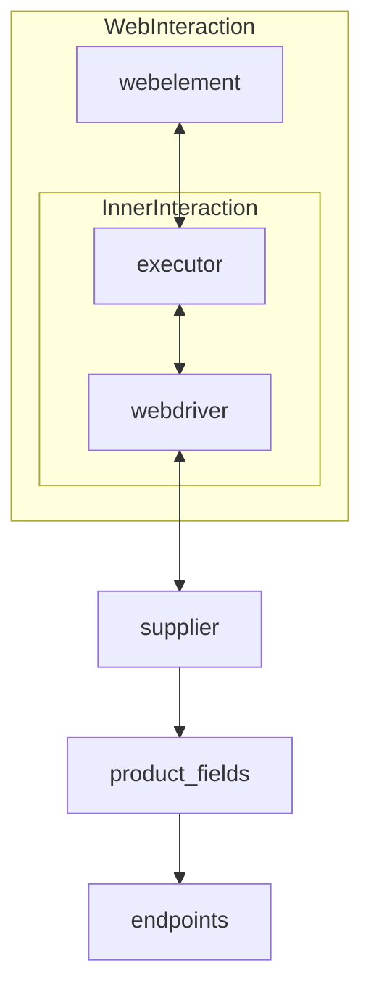

# **Класс** `Supplier`
### **Базовый класс для всех поставщиков**
*В контексте кода `Supplier` - поставщик информации.
Поставщиком может быть производитель какого-либо тавара, данных или информации
Источники потавщика - целевая страница сайта, документ, база данных, таблица.
Класс сводит разных поставщиков к одинаковому алгоритму действий внутри класса.
У каждого поставщика есть свой уникальный префикс. ([подробно о префиксах](prefixes.md))*


Класс `Supplier` служит основой для управления взаимодействиями с поставщиками. 
Он выполняет инициализацию, настройку, аутентификацию и запуск сценариев для различных источников данных, таких как `amazon.com`, `walmart.com`, `mouser.com` и `digikey.com`. Клиент может определить дополнительные поставщики.

---
## Список реализованныx поставщиков:

[aliexpress](aliexpress/README.RU.MD)  - Реализован в двух варианах сценариев: `webriver` и `api` 

[amazon](amazon/README.RU.MD) - `webdriver` 

[bangood](bangood/README.RU.MD)  - `webdriver` 

[cdata](cdata/README.RU.MD)  - `webdriver` 

[chat_gpt](chat_gpt/README.RU.MD)  - Работа с чатом chatgpt (НЕ С МОДЕЛЬЮ!) 

[ebay](ebay/README.RU.MD)  - `webdriver` 

[etzmaleh](etzmaleh/README.RU.MD)  - `webdriver` 

[gearbest](gearbest/README.RU.MD)  - `webdriver` 

[grandadvance](grandadvance/README.RU.MD)  - `webdriver` 

[hb](hb/README.RU.MD)  - `webdriver` 

[ivory](ivory/README.RU.MD) - `webdriver` 

[ksp](ksp/README.RU.MD) - `webdriver`

[kualastyle](kualastyle/README.RU.MD) `webdriver` 

[morlevi](morlevi/README.RU.MD) `webdriver` 

[visualdg](visualdg/README.RU.MD) `webdriver` 

[wallashop](wallashop/README.RU.MD) `webdriver`  

[wallmart](wallmart/README.RU.MD) `webdriver` 

[подробно о вебдрайвере :class: `Driver`](../webdriver/README.RU.MD)    
[подробно о сценариях :class: `Scenario`](../scenarios/README.RU.MD)
---

## **Атрибуты**
- **`supplier_id`** *(int)*: Уникальный идентификатор поставщика.
- **`supplier_prefix`** *(str)*: Префикс поставщика, например, `'amazon'`, `'aliexpress'`.
- **`supplier_settings`** *(dict)*: Настройки поставщика, загружаемые из JSON-файла.
- **`locale`** *(str)*: Код локализации (по умолчанию: `'en'`).
- **`price_rule`** *(str)*: Правила расчета цен (например, правила НДС).
- **`related_modules`** *(module)*: Модули-помощники для работы с конкретным поставщиком.
- **`scenario_files`** *(list)*: Список файлов сценариев для выполнения.
- **`current_scenario`** *(dict)*: Выполняемый в текущий момент сценарий.
- **`login_data`** *(dict)*: Данные для аутентификации.
- **`locators`** *(dict)*: Словарь локаторов веб-элементов.
- **`driver`** *(Driver)*: Экземпляр WebDriver для взаимодействия с сайтом поставщика.
- **`parsing_method`** *(str)*: Метод парсинга данных (например, `'webdriver'`, `'api'`, `'xls'`, `'csv'`).

---

## **Методы**

### **`__init__`**
**Конструктор класса `Supplier`.**

```python
def __init__(self, supplier_prefix: str, locale: str = 'en', webdriver: str | Driver | bool = 'default', *attrs, **kwargs):
    """Инициализация экземпляра Supplier.

    Args:
        supplier_prefix (str): Префикс поставщика.
        locale (str, optional): Код локализации. По умолчанию 'en'.
        webdriver (str | Driver | bool, optional): Тип WebDriver. По умолчанию 'default'.

    Raises:
        DefaultSettingsException: Если настройки по умолчанию не настроены корректно.
    """
```

---

### **`_payload`**
**Загружает настройки поставщика и инициализирует WebDriver.**

```python
def _payload(self, webdriver: str | Driver | bool, *attrs, **kwargs) -> bool:
    """Загружает настройки, локаторы и инициализирует WebDriver.

    Args:
        webdriver (str | Driver | bool): Тип WebDriver.

    Returns:
        bool: Возвращает `True`, если загрузка выполнена успешно.
    """
```

---

### **`login`**
**Обрабатывает аутентификацию на сайте поставщика.**

```python
def login(self) -> bool:
    """Производит аутентификацию пользователя на сайте поставщика.

    Returns:
        bool: Возвращает `True`, если вход выполнен успешно.
    """
```

---

### **`run_scenario_files`**
**Выполняет один или несколько файлов сценариев.**

```python
def run_scenario_files(self, scenario_files: str | List[str] = None) -> bool:
    """Запускает предоставленные файлы сценариев.

    Args:
        scenario_files (str | List[str], optional): Список или путь к файлам сценариев.

    Returns:
        bool: Возвращает `True`, если сценарии выполнены успешно.
    """
```

---

### **`run_scenarios`**
**Выполняет указанные сценарии.**

```python
def run_scenarios(self, scenarios: dict | list[dict]) -> bool:
    """Запускает указанные сценарии.

    Args:
        scenarios (dict | list[dict]): Сценарии для выполнения.

    Returns:
        bool: Возвращает `True`, если все сценарии выполнены успешно.
    """
```

---

## **Как это работает**

1. **Инициализация**:
   - Метод `__init__` настраивает префикс поставщика, локализацию и WebDriver.  
     Пример:
     ```python
     supplier = Supplier(supplier_prefix='aliexpress', locale='en', webdriver='chrome')
     ```

2. **Загрузка настроек**:
   - `_payload` загружает конфигурацию, инициализирует локаторы и WebDriver.  
     Пример:
     ```python
     supplier._payload(webdriver='firefox')
     ```

3. **Аутентификация**:
   - `login` выполняет вход пользователя на сайте поставщика.  
     Пример:
     ```python
     supplier.login()
     ```

4. **Выполнение сценариев**:
   - **Запуск файлов сценариев**:
     ```python
     supplier.run_scenario_files(['example_scenario.json'])
     ```
   - **Запуск конкретных сценариев**:
     ```python
     supplier.run_scenarios([{'action': 'scrape', 'target': 'product_list'}])
     ```
```