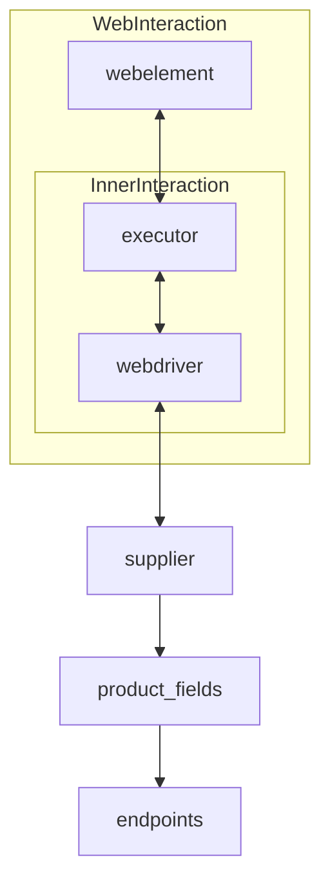

# **Class** `Supplier`
### **Base class for all suppliers**
*In the context of the code, `Supplier` represents an information provider.  
A supplier can be a producer of goods, data, or information.  
The supplier's sources include a website's landing page, a document, a database, or a table.  
This class unifies different suppliers under a standardized set of operations.  
Each supplier has a unique prefix. ([Details on prefixes](prefixes.md))*  

The `Supplier` class serves as the foundation for managing interactions with suppliers.  
It handles initialization, configuration, authentication, and execution of workflows for various data sources, such as `amazon.com`, `walmart.com`, `mouser.com`, and `digikey.com`. Clients can also define additional suppliers.  

---

## List of implemented suppliers:

[aliexpress](aliexpress)  - Implemented with two workflows: `webdriver` and `api`  

[amazon](amazon) - `webdriver`  

[bangood](bangood)  - `webdriver`  

[cdata](cdata)  - `webdriver`  

[chat_gpt](chat_gpt)  - Interacts with the ChatGPT interface (NOT THE MODEL!)  

[ebay](ebay)  - `webdriver`  

[etzmaleh](etzmaleh)  - `webdriver`  

[gearbest](gearbest)  - `webdriver`  

[grandadvance](grandadvance)  - `webdriver`  

[hb](hb)  - `webdriver`  

[ivory](ivory) - `webdriver`  

[ksp](ksp) - `webdriver`  

[kualastyle](kualastyle) `webdriver`  

[morlevi](morlevi) `webdriver`  

[visualdg](visualdg) `webdriver`  

[wallashop](wallashop) `webdriver`  

[wallmart](wallmart) `webdriver`  

[Details on WebDriver :class: `Driver`](../webdriver)  
[Details on workflows :class: `Scenario`](../scenarios)

---

## **Attributes**
- **`supplier_id`** *(int)*: Unique identifier for the supplier.  
- **`supplier_prefix`** *(str)*: Supplier prefix, e.g., `'amazon'`, `'aliexpress'`.  
- **`supplier_settings`** *(dict)*: Supplier settings loaded from a JSON file.  
- **`locale`** *(str)*: Localization code (default: `'en'`).  
- **`price_rule`** *(str)*: Rules for price calculations (e.g., VAT rules).  
- **`related_modules`** *(module)*: Helper modules for specific supplier operations.  
- **`scenario_files`** *(list)*: List of scenario files to be executed.  
- **`current_scenario`** *(dict)*: Scenario currently being executed.  
- **`login_data`** *(dict)*: Data for authentication.  
- **`locators`** *(dict)*: Dictionary of web element locators.  
- **`driver`** *(Driver)*: WebDriver instance for interacting with the supplier's website.  
- **`parsing_method`** *(str)*: Data parsing method (e.g., `'webdriver'`, `'api'`, `'xls'`, `'csv'`).  

---

## **Methods**

### **`__init__`**
**Constructor of the `Supplier` class.**

```python
def __init__(self, supplier_prefix: str, locale: str = 'en', webdriver: str | Driver | bool = 'default', *attrs, **kwargs):
    """Initializes an instance of Supplier.

    Args:
        supplier_prefix (str): The supplier's prefix.
        locale (str, optional): Localization code. Defaults to 'en'.
        webdriver (str | Driver | bool, optional): Type of WebDriver. Defaults to 'default'.

    Raises:
        DefaultSettingsException: If default settings are not properly configured.
    """
```

---

### **`_payload`**
**Loads supplier settings and initializes the WebDriver.**

```python
def _payload(self, webdriver: str | Driver | bool, *attrs, **kwargs) -> bool:
    """Loads settings, locators, and initializes the WebDriver.

    Args:
        webdriver (str | Driver | bool): Type of WebDriver.

    Returns:
        bool: Returns `True` if the loading was successful.
    """
```

---

### **`login`**
**Handles authentication on the supplier's website.**

```python
def login(self) -> bool:
    """Authenticates the user on the supplier's website.

    Returns:
        bool: Returns `True` if login was successful.
    """
```

---

### **`run_scenario_files`**
**Executes one or more scenario files.**

```python
def run_scenario_files(self, scenario_files: str | List[str] = None) -> bool:
    """Runs the provided scenario files.

    Args:
        scenario_files (str | List[str], optional): List or path to scenario files.

    Returns:
        bool: Returns `True` if scenarios were executed successfully.
    """
```

---

### **`run_scenarios`**
**Executes specified scenarios.**

```python
def run_scenarios(self, scenarios: dict | list[dict]) -> bool:
    """Executes specified scenarios.

    Args:
        scenarios (dict | list[dict]): Scenarios to be executed.

    Returns:
        bool: Returns `True` if all scenarios were executed successfully.
    """
```

---

## **How it works**

1. **Initialization**:  
   - The `__init__` method sets up the supplier prefix, localization, and WebDriver.  
     Example:  
     ```python
     supplier = Supplier(supplier_prefix='aliexpress', locale='en', webdriver='chrome')
     ```  

2. **Loading settings**:  
   - `_payload` loads the configuration, initializes locators, and the WebDriver.  
     Example:  
     ```python
     supplier._payload(webdriver='firefox')
     ```  

3. **Authentication**:  
   - `login` logs the user into the supplier's website.  
     Example:  
     ```python
     supplier.login()
     ```  

4. **Executing scenarios**:  
   - **Running scenario files**:  
     ```python
     supplier.run_scenario_files(['example_scenario.json'])
     ```  
   - **Running specific scenarios**:  
     ```python
     supplier.run_scenarios([{'action': 'scrape', 'target': 'product_list'}])
     ```  